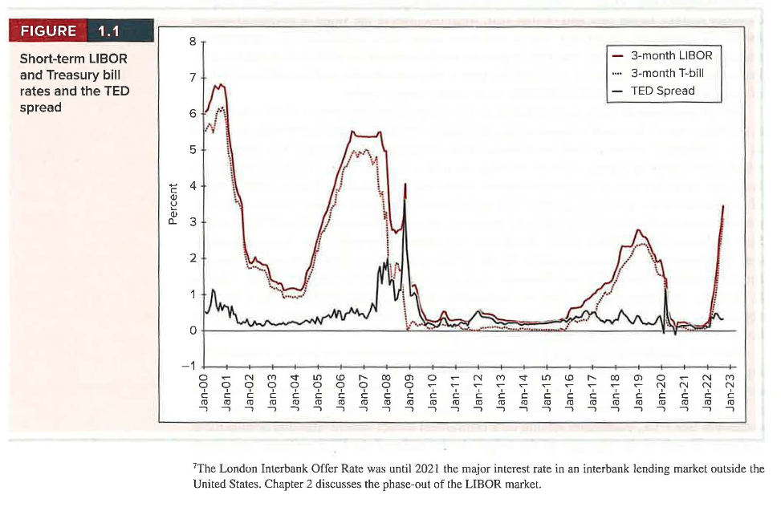
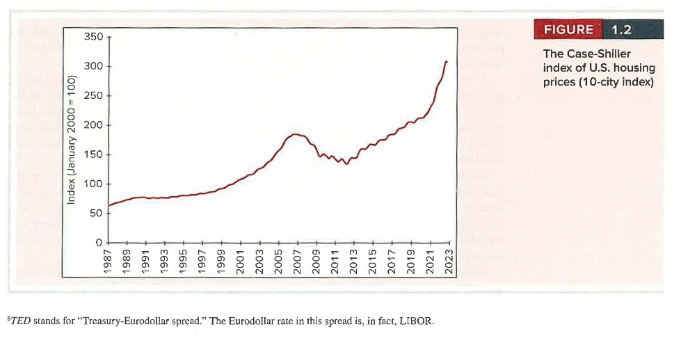
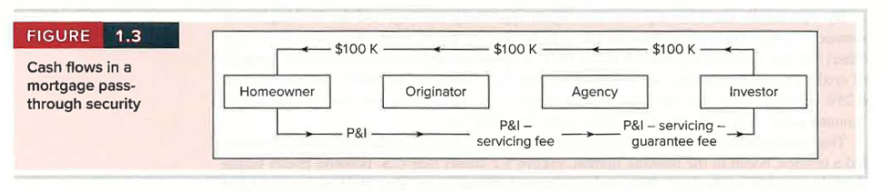

# Learning Objectives

By the end of this chapter, you should be able to:

- **LO 1-1** Define an investment.
- **LO 1-2** Distinguish between real assets and financial assets.
- **LO 1-3** Explain the economic functions of financial markets and how various securities are related to the governance of the corporation.
- **LO 1-4** Describe the major steps in the construction of an investment portfolio.
- **LO 1-5** Identify different types of financial markets and the major participants in each of those markets.
- **LO 1-6** Explain the causes and consequences of the financial crisis of 2008–2009.

## Chapter Roadmap {.unnumbered}

An **investment** is the *current* commitment of money or other resources in the expectation of reaping future benefits. Whether you buy shares of stock or spend time studying this text, all investments share one key attribute: **you sacrifice something of value now, expecting to reap the benefits later.**

This chapter builds the foundation for everything that follows. Broadly, it addresses:

1. The role of **financial assets** in the economy and their relationship to the "real" assets that produce goods and services
2. The **investment process** and the types of decisions investors face
3. Why financial markets are **competitive**, and the resulting risk-return trade-off and efficient pricing of assets
4. The major **players** and intermediaries in financial markets
5. The **financial crisis of 2008–2009** and the lessons it teaches about systemic risk

------------------------------------------------------------------------

## 1.1 Real Assets versus Financial Assets

The material wealth of a society is ultimately determined by the productive capacity of its economy—the goods and services its members can create. This capacity is a function of the **real assets** of the economy: the land, buildings, equipment, and knowledge that can be used to produce goods and services.

In contrast are **financial assets** such as stocks and bonds. These securities are little more than sheets of paper (or, today, database entries) and do not directly contribute to the productive capacity of the economy. Instead, they are the means by which individuals hold their claims on real assets. If we cannot own our own auto plant (a real asset), we can still buy shares in Ford or Toyota (financial assets) and share in the income derived from producing automobiles.

**Key distinction:**

- **Real assets** generate net income to the economy.
- **Financial assets** simply define the allocation of income or wealth among investors.

When investors buy securities issued by companies, the firms use the money raised to pay for real assets. So investors' returns ultimately come from the income produced by the real assets financed by those securities.

The distinction is apparent when we compare the balance sheet of U.S. households (Table 1.1) with the composition of national wealth (Table 1.2). Household wealth includes financial assets such as bank accounts, corporate stock, and bonds. But debt securities that are financial *assets* of the households that hold them are *liabilities* of the issuers. For example, a bond that gives you a claim on interest and principal from Toyota is a liability of Toyota. **Your asset is Toyota's liability.** When we aggregate over all balance sheets, these claims cancel out, leaving only real assets as the net wealth of the economy.

**Table 1.1 — Balance sheet of U.S. households**

| Assets | \$ Billion | % Total | Liabilities and Net Worth | \$ Billion | % Total |
|---|---:|---:|---|---:|---:|
| **Real assets** | | | **Liabilities** | | |
| Real estate | \$45,531 | 28.0% | Mortgages | \$12,159 | 7.5% |
| Consumer durables | 7,674 | 4.7 | Consumer credit | 4,582 | 2.8 |
| Other | 780 | 0.5 | Bank and other loans | 1,294 | 0.8 |
| *Total real assets* | \$53,984 | 33.2% | Other | 887 | 0.5 |
| | | | *Total liabilities* | \$18,923 | 11.6% |
| **Financial assets** | | | | | |
| Deposits and money market shares | \$18,519 | 11.4% | | | |
| Life insurance reserves | 1,888 | 1.2 | | | |
| Pension reserves | 29,930 | 18.4 | | | |
| Corporate equity | 25,290 | 15.5 | | | |
| Equity in noncorp. business | 16,143 | 9.9 | | | |
| Mutual fund shares | 9,969 | 6.1 | | | |
| Debt securities | 5,216 | 3.2 | | | |
| Other | 1,749 | 1.1 | | | |
| *Total financial assets* | 108,702 | 66.8 | Net worth | \$143,763 | 88.4% |
| **Total** | \$162,686 | 100.0% | **Total** | \$162,686 | 100.0% |

*Note: Column sums may differ from total because of rounding. Source: Flow of Funds Accounts of the United States, Board of Governors of the Federal Reserve System, September 2022.*

**Table 1.2 — Domestic net worth**

| Assets | \$ Billion |
|---|---:|
| Commercial real estate | \$23,062 |
| Residential real estate | 56,173 |
| Equipment & intellectual property | 11,561 |
| Inventories | 3,763 |
| Consumer durables | 7,674 |
| **Total** | \$102,233 |

*Note: Column sums may differ from total because of rounding. Source: Flow of Funds Accounts of the United States, Board of Governors of the Federal Reserve System, September 2022.*

We will focus almost exclusively on financial assets. But keep in mind that the successes or failures of these financial assets ultimately depend on the performance of the underlying real assets.

::: {.callout-note}
## Concept Check 1.1

Are the following assets real or financial?

a. Patents
b. Lease obligations
c. Customer goodwill
d. A college education
e. A \$5 bill
:::

::: {.callout-tip collapse="true"}
## Solution to Concept Check 1.1

a. Real
b. Financial
c. Real
d. Real
e. Financial
:::

------------------------------------------------------------------------

## 1.2 Financial Assets

It is common to distinguish among three broad types of financial assets: **debt, equity, and derivatives.**

**Fixed-income (debt) securities** promise either a fixed stream of income or a stream of income determined by a specified formula. A corporate bond typically promises a fixed amount of interest each year; floating-rate bonds promise payments that depend on current interest rates. Unless the borrower is declared bankrupt, the payments are either fixed or determined by formula—so the performance of debt securities is *least* closely tied to the financial condition of the issuer.

Fixed-income securities come in a wide variety of maturities and payment provisions:

- **Money market** securities are short term, highly marketable, and generally very low risk (for example, U.S. Treasury bills or bank certificates of deposit).
- The fixed-income **capital market** includes long-term securities such as Treasury bonds, as well as bonds issued by federal agencies, municipalities, and corporations. These range from very safe (Treasury securities) to relatively risky (high-yield, or "junk," bonds).

**Equity** (common stock) represents an ownership share in a corporation. Equityholders are not promised any particular payment; they receive any dividends the firm pays and have prorated ownership in the firm's real assets. Because the performance of equity is tied directly to the success of the firm, equity investments tend to be riskier than debt.

**Derivative securities** such as options and futures contracts provide payoffs that are determined by the prices of *other* assets such as bond or stock prices. Their values *derive* from the prices of those other assets—hence the name. For example, a call option on Intel stock may be worthless if the share price stays below the exercise price but valuable if the price rises above it.

Derivatives are an integral part of the investment environment. Their primary use is to **hedge risks or transfer them to other parties**, but they can also be used to take highly speculative positions. Beyond securities, investors and corporations also encounter markets for **foreign exchange** (around \$2 trillion of currency traded daily, plus \$4 trillion of currency derivatives) and **commodities** (corn, wheat, natural gas, gold, silver, and so on, traded on exchanges such as the CME Group). Commodity and derivative markets let firms adjust their exposure to business risks—for example, a construction firm can lock in the price of copper with futures contracts.

------------------------------------------------------------------------

## 1.3 Financial Markets and the Economy

Real assets determine the wealth of an economy, while financial assets merely represent claims on real assets. Nevertheless, financial assets and the markets in which they trade play several crucial roles that allow us to make the most of the economy's real assets.

### The Informational Role of Financial Markets

Stock prices reflect investors' collective assessment of a firm's current performance and future prospects. When the market is more optimistic about a firm, its share price rises, making it easier for the firm to raise capital and encouraging investment. In this way, **stock prices play a major role in the allocation of capital**, directing it toward the firms and applications with the greatest perceived potential.

Do capital markets always channel resources to the most efficient use? At times they appear to fail—industries can be "hot" (recall the dot-com bubble that collapsed in 2000), attract a flood of capital, and then fail. But no one knows with certainty which ventures will succeed, so it is unreasonable to expect markets never to make mistakes. To paraphrase Winston Churchill's comment about democracy, **markets may be the worst way to allocate capital except for all the others that have been tried.**

### Consumption Timing

Some individuals earn more than they currently wish to spend; others (such as retirees) spend more than they currently earn. Financial assets let you **shift purchasing power across time.** In high-earnings periods, you invest savings in stocks and bonds; in low-earnings periods, you sell these assets to fund consumption. Thus, financial markets allow individuals to separate decisions about current consumption from constraints imposed by current earnings.

### Allocation of Risk

Virtually all real assets involve risk. Financial markets and the diverse instruments traded in them allow investors with the greatest taste for risk to bear it, while more risk-averse individuals can stay on the sidelines. For example, if Toyota raises funds by selling both stocks and bonds, risk-tolerant investors can buy the stock while conservative investors buy the bonds. Because bonds promise a fixed payment, stockholders bear most of the business risk but reap potentially higher rewards. This allocation of risk also benefits firms: when investors can select the risk-return characteristics that suit them, each security can be sold for the best possible price.

### Separation of Ownership and Management

Many small businesses are owned and managed by the same individual, but large corporations cannot exist as owner-operated firms. A large group of shareholders elects a **board of directors** that hires and supervises management, so the owners and managers are different parties. This gives the firm stability: if some stockholders no longer wish to hold shares, they can sell to other investors with no impact on management.

How do disparate owners agree on the firm's objectives? While their particular goals vary, all shareholders are better able to achieve their personal goals when the firm acts to **enhance the value of their shares.** For this reason, value maximization has for decades been widely accepted as a useful organizing principle—though more recently some observers argue the firm should balance the interests of its many "stakeholders."

**Agency problems.** Managers, who are hired as agents of the shareholders, may pursue their own interests instead (empire building, avoiding risky projects, or overconsuming perquisites such as corporate jets). These conflicts of interest are called **agency problems.** Several mechanisms have evolved to mitigate them:

- **Compensation plans** tie managers' income to the success of the firm (shares and stock options), though overuse of options can create its own agency problem.
- **Boards of directors** can force out underperforming management teams.
- **Outside monitors** such as security analysts and large institutional investors watch the firm closely.
- **The threat of takeover.** Unhappy shareholders can launch a *proxy contest* to replace the board; the rise of **activist investors** (often hedge funds) has increased the odds of a successful contest. Aside from proxy contests, the real takeover threat comes from other firms acquiring an underperformer and replacing its management.

> **Example 1.1 — Activist Investors and Corporate Control.** Well-known activist investors include Nelson Peltz (Trian), Dan Loeb (Third Point), Carl Icahn, Christer Gardell (Cevian Capital), and Paul Singer (Elliott Management). A newcomer, Engine No. 1, gained the backing of large institutional investors like BlackRock and Vanguard and in 2021 won three seats on the board of ExxonMobil.

### Stakeholder Capitalism and ESG Investing

The orthodoxy since the 1970s was that the firm should maximize value. But in 2019, America's Business Roundtable advocated for broader goals addressing the interests of other stakeholders—employees, customers, and communities—highlighting a tension between "shareholder capitalism" and "stakeholder capitalism."

Critics of pure value maximization argue that firms should be encouraged (or forced) to take a broader view of their obligations, and that long-term value maximization requires *sustainable* strategies. These criteria are grouped under **ESG investing** (environmental, social, and governance). The ESG sector exploded in recent years, with assets under management in ESG mutual funds fluctuating around \$500 billion in 2022.

Traditionalists counter that an unfocused commitment to many competing interests could impede accountability, that many managers are legally bound by **fiduciary duty** to invest solely in clients' interests, and that competition may force firms to pursue value-maximizing strategies regardless. Evidence so far offers little support that ESG investing delivers higher returns. A middle-ground approach emphasizes **enlightened self-interest**: it can be value maximizing to build a good reputation, avoid scandal, and treat customers well.

In practice, ESG investing is controversial. One issue is **"greenwashing,"** in which firms claim to follow ESG criteria (or rebrand funds) without actually pursuing those policies. There is no commonly accepted definition of ESG, and different data providers score firms differently. The SEC is concerned that investors overpay for funds that adopt an ESG label without adhering to meaningful standards; in 2022 it fined BNY Mellon for "misstatements and omissions" concerning some of its ESG-labeled funds.

### Corporate Governance and Corporate Ethics

Market signals allocate capital efficiently only if investors act on **accurate information**—markets must be *transparent.* If firms can mislead the public, much can go wrong.

The years 2000–2002 were filled with scandals that signaled a crisis in corporate governance and ethics:

- **WorldCom** overstated profits by at least \$3.8 billion, resulting in the largest U.S. bankruptcy at the time.
- **Enron** used "special purpose entities" to move debt off its books and present a misleading picture of its financial status.
- Other firms (Rite Aid, HealthSouth, Global Crossing, Qwest) and the Italian dairy firm **Parmalat** also manipulated their accounts.
- **Auditors** faced skewed incentives—Enron's auditor, Arthur Andersen, earned more consulting for Enron than auditing it.

In response, Congress passed the **Sarbanes-Oxley Act (SOX)** in 2002 to tighten corporate governance and disclosure. Among other things, it requires more independent directors, requires each CFO to personally vouch for the firm's accounting statements, provides for an oversight board over public-company auditing, and prohibits auditors from providing various other services to clients.

------------------------------------------------------------------------

## 1.4 The Investment Process

Investors' **portfolios** are their collections of investment assets. A portfolio is periodically updated, or "rebalanced," by buying and selling securities. Constructing a portfolio involves two types of decisions:

- The **asset allocation** decision—the choice among broad asset classes (stocks, bonds, real estate, commodities, and so on).
- The **security selection** decision—the choice of which particular securities to hold *within* each asset class.

**"Top-down"** portfolio construction starts with asset allocation. Because asset classes differ dramatically in risk and return, this decision has great ramifications. For example, since 1926 the average annual return on the common stock of large firms has been about 12% per year, versus less than 4% for U.S. Treasury bills—but stocks are far riskier, with annual returns (S&P 500) ranging from about −46% to +55%, while T-bill returns are effectively risk free.

**Security analysis** involves the valuation of particular securities that might be included in the portfolio (for example, whether Merck or Pfizer is more attractively priced). In contrast, a **"bottom-up"** strategy constructs the portfolio from securities that seem attractively priced without as much concern for the resulting asset allocation—which can lead to unintended bets on a single sector.

------------------------------------------------------------------------

## 1.5 Markets Are Competitive

Financial markets are highly competitive. Thousands of well-backed analysts constantly scour securities markets for the best buys, so we should expect to find few, if any, **"free lunches"**—securities so underpriced that they are obvious bargains. Two implications of this no-free-lunch proposition follow.

### 1.5.1 The Risk-Return Trade-off

Investors invest for anticipated future returns, but those returns rarely can be predicted precisely; actual returns almost always deviate from expectations. (In 1931, the worst year since 1926, the market lost 46%; in 1933, the best year, it gained 55%.)

If all else could be held equal, investors would prefer the highest expected return. But the no-free-lunch rule says all else cannot be equal: **to earn higher expected returns, you must accept higher risk.** If any asset offered a higher expected return without extra risk, investors would rush to buy it, driving its price up until its expected return was no more than commensurate with its risk. We therefore conclude there should be a **risk-return trade-off**, with higher-risk assets priced to offer higher expected returns.

Measuring risk is not simple. When assets are combined into **diversified portfolios**, we must consider the interplay among assets and the effect of diversification on the risk of the entire portfolio. *Diversification* means holding many assets so that exposure to any one is limited. These topics form the core of **modern portfolio theory**, whose pioneers Harry Markowitz and William Sharpe were awarded Nobel Prizes.

### 1.5.2 Efficient Markets

Another implication is that we should rarely expect to find bargains. The **efficient market hypothesis** holds that security prices already reflect all information available about the value of a security; as new information becomes available, the price quickly adjusts, so at any time the price equals the market consensus estimate of value.

This has implications for the choice between two management styles:

- **Passive management** calls for holding a highly diversified portfolio without spending resources trying to improve performance through security analysis.
- **Active management** is the attempt to improve performance by identifying mispriced securities or by timing broad asset classes.

If markets were perfectly efficient, active analysis would be pointless. But without ongoing analysis, prices would depart from correct values, creating incentives for experts to move in. In practice we may observe only *near*-efficiency, leaving profit opportunities for especially insightful investors—so portfolio construction must account for the likelihood of nearly efficient markets.

------------------------------------------------------------------------

## 1.6 The Players

From a bird's-eye view, there are three major players in financial markets:

1. **Firms** are net *demanders* of capital. They raise capital to pay for investments in plant and equipment.
2. **Households** typically are *suppliers* of capital. They purchase the securities issued by firms.
3. **Governments** can be borrowers or lenders. Since World War II, the U.S. government has typically run budget deficits and borrows by issuing Treasury bills, notes, and bonds.

Corporations and governments do not sell most securities directly to individuals. About half of all stock is held by large financial institutions—pension funds, mutual funds, insurance companies, and banks—that stand between the security issuer and the ultimate owner. These institutions are called **financial intermediaries.** Similarly, corporations hire agents called **investment bankers** to represent them to the investing public.

### 1.6.1 Financial Intermediaries

Households want desirable investments for their savings, but their small financial size makes direct investment difficult: a small investor cannot easily find a desirable borrower, diversify across borrowers, or assess and monitor credit risk.

For these reasons, **financial intermediaries**—banks, investment companies, insurance companies, and credit unions—evolved to bring together suppliers of capital (investors) with demanders of capital (corporations and government). They issue their own securities to raise funds and use the proceeds to purchase the securities of other corporations. A bank, for example, raises funds by taking deposits and lends that money to borrowers; the **spread** between the rates paid to depositors and charged to borrowers is the source of its profit.

Financial intermediaries are distinguished from other businesses in that both their assets and their liabilities are overwhelmingly **financial.** Table 1.3 shows the aggregated balance sheet of commercial banks—notice that real assets are a very small share. Compare this to the nonfinancial corporate sector (Table 1.4), where real assets are about half of all assets. The contrast arises because intermediaries simply move funds from one sector to another; their primary social function is to channel household savings to the business sector.

**Table 1.3 — Balance sheet of FDIC-Insured Commercial Banks and Savings Institutions**

| Assets | \$ Billion | % Total | Liabilities and Net Worth | \$ Billion | % Total |
|---|---:|---:|---|---:|---:|
| **Real assets** | | | **Liabilities** | | |
| Equipment and premises | \$187.9 | 0.8% | Deposits | \$19,563.3 | 82.4% |
| Other real estate | 2.8 | 0.0 | Debt and other borrowed funds | 978.2 | 4.1 |
| *Total real assets* | \$190.7 | 0.8% | Federal funds and repurchase agreements | 301.7 | 1.3 |
| | | | Other | 654.8 | 2.8 |
| | | | *Total liabilities* | \$21,498.0 | 90.6% |
| **Financial assets** | | | | | |
| Cash | \$2,821.6 | 11.9% | | | |
| Investment securities | 6,148.6 | 25.9 | | | |
| Loans and leases | 11,592.5 | 48.9 | | | |
| Other financial assets | 1,454.4 | 6.1 | | | |
| *Total financial assets* | \$22,017.1 | 92.8% | | | |
| **Other assets** | | | | | |
| Intangible assets | \$421.5 | 1.8% | | | |
| Other | 1,098.2 | 4.6 | | | |
| *Total other assets* | \$1,519.7 | 6.4% | Net worth | \$2,229.5 | 9.4% |
| **Total** | \$23,727.5 | 100.0% | **Total** | \$23,727.5 | 100.0% |

*Note: Column sums may differ from total because of rounding. Source: Federal Deposit Insurance Corporation, www.fdic.gov, September 2022.*

**Table 1.4 — Balance sheet of nonfinancial U.S. corporations**

| Assets | \$ Billion | % Total | Liabilities and Net Worth | \$ Billion | % Total |
|---|---:|---:|---|---:|---:|
| **Real assets** | | | **Liabilities** | | |
| Equipment & intellectual property | \$9,314 | 17.0% | Debt securities | \$7,542 | 13.8% |
| Real estate | 16,479 | 30.1 | Bank loans & mortgages | 2,526 | 4.6 |
| Inventories | 3,481 | 6.4 | Other loans | 2,492 | 4.5 |
| *Total real assets* | \$29,273 | 53.4% | Trade debt | 3,519 | 6.4 |
| | | | Other | 8,636 | 15.8 |
| | | | *Total liabilities* | \$24,715 | 45.1% |
| **Financial assets** | | | | | |
| Deposits and cash | \$2,844 | 5.2% | | | |
| Marketable securities | 3,177 | 5.8 | | | |
| Trade and consumer credit | 4,942 | 9.0 | | | |
| Other | 14,541 | 26.5 | | | |
| *Total financial assets* | 25,504 | 46.6 | Net worth | \$30,062 | 54.9% |
| **Total** | \$54,777 | 100.0% | **Total** | \$54,777 | 100.0% |

*Note: Column sums may differ from total because of rounding. Source: Flow of Funds Accounts of the United States, Board of Governors of the Federal Reserve System, September 2022.*

Intermediaries offer three advantages in their role: by pooling many small investors' resources, they can lend considerable sums; by lending to many borrowers, they achieve **diversification**; and they build **expertise** through the volume of business they do.

**Investment companies**, which pool and manage the money of many investors, also arise from economies of scale. Most household portfolios are not large enough to be spread among many securities, and buying one or two shares of many firms is expensive. **Mutual funds** offer large-scale trading and portfolio management, assigning each investor a prorated share for a management fee. Like mutual funds, **hedge funds** pool investors' money, but they are open only to institutional or wealthy investors, pursue more complex and higher-risk strategies, and typically keep a portion of trading profits as fees.

### 1.6.2 Investment Bankers

Just as economies of scale create niches for financial intermediaries, they also create niches for firms performing specialized services. Because firms do not issue securities frequently, **investment bankers** who specialize in such activities can offer their services more cheaply than an in-house division.

Investment bankers advise issuing corporations on prices and interest rates and handle the marketing of new securities in the **primary market**, where new issues are offered to the public. In this role, the banks are called **underwriters.** Later, investors trade previously issued securities among themselves in the **secondary market.**

> **On the Market Front — Separating Commercial from Investment Banking.** Until 1999, the **Glass-Steagall Act** separated commercial and investment banking. After its repeal, many commercial banks became "universal banks." In 2008, several stand-alone investment banks failed or were absorbed: Bear Stearns merged into JPMorgan Chase, Merrill Lynch was acquired by Bank of America, Lehman Brothers entered the largest bankruptcy in U.S. history, and Goldman Sachs and Morgan Stanley converted to bank holding companies. The **Dodd-Frank Act** later placed new restrictions on bank activities, including the **Volcker Rule**, which prohibits banks from "proprietary trading" and restricts their investments in hedge funds or private equity funds.

### 1.6.3 Venture Capital and Private Equity

Smaller and younger firms that have not yet issued securities to the public rely on bank loans and on investors willing to take an ownership stake. Equity investment in these young companies is called **venture capital (VC).** Sources include dedicated VC funds, wealthy individuals known as *angel investors*, and institutions such as pension funds.

Most VC funds are set up as limited partnerships. The management company raises capital from limited partners, invests it in start-ups, usually sits on the start-up's board, and provides business advice. Some active investors instead focus on firms in distress or firms that can be bought, "improved," and sold for a profit. Collectively, investments in firms that do not trade on public stock exchanges are known as **private equity.**

### 1.6.4 Fintech, Financial Innovation, and Decentralized Finance

When the needs of market participants create profit opportunities, markets tend to provide the desired services—often spurred by technological advances. **Fintech** is the application of technology to financial markets. While much of finance relies on intermediaries, technology allowing individuals to interact directly has led to some financial **disintermediation.** This trend toward eliminating the middleman has been dubbed **decentralized finance, or DeFi.**

#### 1.6.4.1 Peer-to-Peer Lending

*Peer-to-peer lending* links lenders and borrowers directly, without an intermediary like a commercial bank. A major player is **LendingClub**, whose website allows borrowers to apply for personal loans up to \$40,000 or business loans up to \$300,000. The borrower is given a credit score, and lenders decide whether to participate. LendingClub does not itself lend funds—its platform provides information and lets the parties interact directly.

#### 1.6.4.2 Robo Advice

While the very wealthy can afford financial advisors, most investors cannot justify that expense. **Robo advisors** bring affordable advice to a wide swath of investors. You fill out an online questionnaire about your financial situation and risk tolerance, and a computer algorithm recommends a portfolio—usually low-cost mutual or exchange-traded funds—and may periodically rebalance your account.

#### 1.6.4.3 Blockchains

We are accustomed to transactions recorded in a **centralized ledger** administered by a trusted party (a credit card company, bank, or stock exchange). Such ledgers do not allow anonymity and can be targets of hackers.

In contrast, **blockchains** provide a record of transactions distributed over a network of connected computers. No single administrator controls it, so there is no single target for hackers. New transactions are securely added to a public *distributed ledger*; identities can be masked, allowing anonymity. Because the ledger is distributed and public, it is difficult to bypass or manipulate the historical record, and there is no need for a trusted central administrator.

Blockchain is most associated with cryptocurrency, but it suits a wider range of secure digital transactions (secure sharing of medical data, supply chain monitoring) and enables **"smart contracts"** in which software authorizes transactions in response to a triggering event without human intervention. Another innovation is the **NFT (non-fungible token)**, which is proof of ownership of a digital asset.

#### 1.6.4.4 Cryptocurrencies

**Cryptocurrencies** such as Bitcoin or Ethereum use blockchain technology to create payment systems that bypass traditional channels like credit cards or checks, providing both security and anonymity. Bitcoin was introduced in 2009; by 2022 there were roughly 4,000 different cryptocurrencies, though most have negligible trading volume and are far smaller than Bitcoin or Ethereum.

Cryptocurrency's promise as an alternative to traditional money remains unclear. Challenges include:

- **Price volatility** (in 2022, one bitcoin ranged from about \$17,000 to more than \$46,000), making it a problematic store of value.
- **Enormous energy costs** for the computers that validate transactions.
- **Slow validation** compared to the traditional credit card network.

A more recent innovation is the **stablecoin**, a cryptocurrency the issuer pledges to redeem for a conventional currency on demand. Stable-dollar coins are typically backed by holdings of dollars; in other cases collateral may be other assets, generally requiring **overcollateralization.** Without adequate collateral, stablecoins are vulnerable to "runs."

#### 1.6.4.5 Digital Tokens

A variation on cryptocurrency is the digital token issued in an **initial coin offering (ICO)**—a source of crowdfunding in which start-ups raise cash by selling digital tokens. The token can eventually be used to buy the start-up's products or services, but once issued, tokens can also be bought and sold among investors, allowing speculation. Some argue these coins are in fact securities that should be subject to SEC regulation; a few countries (China, South Korea) have banned ICOs altogether.

#### 1.6.4.6 Digital Currency

As cryptocurrencies have become more familiar, sovereign governments have begun to contemplate **digital currencies issued by their own central banks.** For example, a government might pay tax refunds directly into a citizen's digital wallet. Like cryptocurrencies, such a system would bypass the traditional financial system and its fees—but unlike them, it would not be subject to fluctuating value. China is already running trials of a digital yuan, and the Fed announced in 2021 that it would study the feasibility of a U.S. digital currency. Open questions surround security, privacy, and government access to financial activity.

#### 1.6.4.7 Cryptowinter, 2022

The year 2022 was a debacle for the cryptocurrency market. In the first half, steep declines forced the stablecoin **TerraUSD** to abandon its peg to the dollar, leading to the crash of its affiliated currency **Luna.** Investors lost virtually their entire stakes, and the loss of confidence drove further declines.

Terra's problems were eclipsed by the scandal at **FTX**, then one of the world's largest crypto exchanges. Though called an "exchange," FTX operated more like a brokerage that held customer funds. It turned out FTX had diverted billions of dollars of customer assets to the hedge fund **Alameda Research**, also owned by FTX's founder Sam Bankman-Fried. When prices plunged in November, customers scrambled to withdraw; unable to meet redemptions, FTX filed for bankruptcy, and it became apparent customer money had been used for improper purposes.

The FTX scandal highlighted a deep irony: crypto's original selling point was the decentralized ledger, yet many investors used familiar **centralized systems** (trading accounts at exchanges like FTX) to trade—an arrangement only as safe as the manager of the ledger. In the meantime, crypto prices had fallen by roughly 70% from their 2021 highs.

------------------------------------------------------------------------

## 1.7 The Financial Crisis of 2008–2009

This section offers a capsule summary of the crisis and the lessons it teaches about the role of the financial system and **systemic risk**—themes the text returns to in greater detail later.

### Antecedents of the Crisis

In early 2007, most observers thought it inconceivable that within two years the world financial system would face its worst crisis since the Great Depression. After the high-tech bubble of 2000–2002, the Federal Reserve aggressively reduced interest rates. As Figure 1.1 shows, Treasury bill and LIBOR rates dropped drastically between 2001 and 2004, and the recession was short-lived and mild.

The **TED spread**—the spread between LIBOR (at which banks borrowed) and the Treasury bill rate (at which the government borrows)—is a common measure of credit risk in the banking sector. It was only around 0.25% in early 2007, suggesting fears of default were extremely low.

The combination of low interest rates and an apparently stable economy fed a historic housing boom. As Figure 1.2 shows, U.S. housing prices began rising in the late 1990s and accelerated after 2001; in the 10 years beginning 1997, average prices approximately tripled. Low yields left investors hungry for higher-yielding alternatives, and optimism encouraged greater risk tolerance—nowhere more evident than in the exploding market for securitized mortgages.

### Changes in Housing Finance

Prior to 1970, most mortgage loans came from a local lender such as a savings bank or credit union, which held the long-term loans as its major asset. This began to change in the 1970s when **Fannie Mae** (FNMA) and **Freddie Mac** (FHLMC) began buying large quantities of mortgages, bundling them into pools that could be traded like any other financial asset. These pools were dubbed "mortgage-backed securities," and the process was called **securitization.** Because cash flows passed from the homeowner to the lender, to Fannie or Freddie, and finally to the investor, the securities were also called **pass-throughs** (Figure 1.3).

Until the mid-2000s, most securitized mortgages were low-risk **conforming mortgages**—eligible loans could not be too big, and borrowers had to meet underwriting criteria (for example, a loan-to-value ratio no more than 80%). Once securitization took hold, it created an opening for **private-label pass-throughs** of nonconforming **"subprime"** loans with higher default risk. In these private-label pools, the *investor* bore the default risk, so originating mortgage brokers had little incentive to perform due diligence as long as the loans could be sold. Underwriting standards deteriorated toward **low-** and then **no-documentation** loans, and allowed leverage rose dramatically.

**Adjustable rate mortgages (ARMs)** grew popular, offering low initial "teaser" rates that later reset to current market yields. Rising home prices had lulled investors into complacency, but starting in 2004 the ability of refinancing to save a loan began to diminish, and mortgage default rates began to surge in 2007.

### Mortgage Derivatives

Who was willing to buy all these risky subprime mortgages? Securitization, restructuring, and credit enhancement provide much of the answer. **Collateralized debt obligations (CDOs)** were designed to concentrate the credit risk of a bundle of loans on one class of investors, leaving others relatively protected. The pool was divided into senior versus junior slices called **tranches.** Senior tranches had first claim on repayments; junior tranches were paid only after seniors received their cut.

Because default rates above a certain level seemed extremely unlikely, senior tranches were commonly granted the highest (AAA) rating by Moody's, Standard & Poor's, and Fitch—so large amounts of AAA-rated securities were carved out of pools of low-rated mortgages. We now know these ratings were wrong: when housing prices fell across the *entire* country, defaults rose in all regions and the hoped-for benefits of geographic diversification never materialized. The rating agencies had used historical data from an unrepresentative housing boom and extrapolated to a new kind of borrower pool (including "liar loans").

::: {.callout-note}
## Concept Check 1.2

When Freddie Mac and Fannie Mae pooled conforming mortgages into securities, they guaranteed the underlying mortgage loans against homeowner defaults. In contrast, there were no guarantees on the mortgages pooled into subprime mortgage–backed securities, so investors bore the exposure to credit risk. Were either of these arrangements necessarily a better way to manage and allocate default risk?
:::

::: {.callout-tip collapse="true"}
## Solution to Concept Check 1.2

The central issue is the incentive and ability to monitor the quality of loans, both when originated and over time. Freddie and Fannie clearly had an incentive to monitor the quality of the conforming loans they guaranteed, and their ongoing relationships with originators gave them opportunities to evaluate track records over time. In the subprime market, the ultimate investors bearing the credit risk should not have been willing to invest in loans with a disproportional likelihood of default; had they properly understood their exposure, the low prices they would have paid would have imposed discipline on originators. The fact that they held such large positions suggests they did not appreciate their exposure—perhaps led astray by overly optimistic housing-price projections or biased credit ratings. While in principle either arrangement could have provided appropriate discipline, in practice the informational advantages of Freddie and Fannie probably made them the better "recipients" of default risk. **The lesson is that information and transparency are among the preconditions for well-functioning markets.**
:::

### Credit Default Swaps

In parallel to the CDO market, the market in **credit default swaps (CDS)** also exploded. A credit default swap is in essence an insurance contract against the default of one or more borrowers; the purchaser pays an annual premium for protection from credit risk. CDS became an alternative method of credit enhancement, seemingly allowing investors to buy subprime loans and insure their investments. But in practice, some swap issuers ramped up their exposure to unsupportable levels without sufficient capital—for example, the insurer **AIG** alone sold more than \$400 billion of CDS contracts on subprime mortgages.

### The Rise of Systemic Risk

By 2007, the financial system displayed several troubling features. Many large institutions had adopted a precarious financing scheme: **borrowing short term** at low rates to finance holdings in **higher-yielding, long-term, illiquid** assets. Relying on short-term loans meant they had to constantly refinance or else sell illiquid assets in a stressed market. These institutions were highly **leveraged** with little capital as a buffer, so even small losses could drive their net worth negative.

This model was brimming with **systemic risk**—a potential breakdown of the financial system when problems in one market spill over and disrupt others. When lenders such as banks have limited capital and fear further losses, they may rationally hoard capital rather than lend it, exacerbating funding problems for their customary borrowers.

### The Shoe Drops

By fall 2007, housing prices were in decline and mortgage delinquencies soared. The crisis peaked in September 2008:

- **September 7:** Fannie Mae and Freddie Mac were put into conservatorship.
- **September 14:** Merrill Lynch was sold to Bank of America.
- **September 15:** Lehman Brothers, denied equivalent treatment, filed for bankruptcy—the largest in U.S. history.
- **September 17:** The government reluctantly lent \$85 billion to AIG, whose failure would have been highly destabilizing given its CDS contracts.

A devastating fallout was on the **money market** for short-term lending. Lehman had borrowed by issuing **commercial paper**; money market mutual funds were major holders. When Lehman faltered, customers rushed to withdraw funds, which fled commercial paper into safer Treasury bills, essentially shutting down short-term financing markets. As the TED spread skyrocketed (Figure 1.1), banks became unwilling or unable to extend credit. Thousands of small businesses could not finance operations, unemployment rose rapidly, and the economy entered its worst recession in decades—**Main Street had joined Wall Street** in protracted misery.

The crisis was not limited to the United States. Housing markets fell worldwide, and many European banks had to be rescued by governments that were themselves heavily in debt, spiraling the banking crisis into a **sovereign debt crisis.** Greece was the hardest hit: it defaulted in 2011 on debts totaling around \$130 billion and required rescue packages from the European Union, the European Central Bank, and the International Monetary Fund.

### The Dodd-Frank Reform Act

The crisis led to the passage in 2010 of the **Dodd-Frank Wall Street Reform and Consumer Protection Act**, which contains several mechanisms to mitigate systemic risk:

- **Stricter rules** for bank capital, liquidity, and risk management, especially as banks become larger. Bank capital levels are higher today than before the crisis.
- **Annual stress tests** for large banks to simulate whether they have enough capital to withstand economic duress.
- The **Volcker Rule**, which limits a bank's ability to trade for its own account and to own or invest in a hedge fund or private equity fund.

Recent legislation has resulted in a **partial rollback.** In 2018, Congress passed the Economic Growth, Regulatory Relief and Consumer Protection Act, exempting most small- to medium-sized banks from Dodd-Frank rules (including stress tests) and exempting smaller banks from the Volcker Rule. Regardless of further regulatory changes, the crisis made clear the essential role of the financial system in the functioning of the real economy.

------------------------------------------------------------------------

## 1.8 Outline of the Text

The text has six parts, which are fairly independent and may be studied in a variety of sequences:

- **Part One** — An introduction to financial markets, instruments, and trading of securities; also describes the mutual fund industry.
- **Part Two** — A detailed presentation of *modern portfolio theory*: diversification and portfolio risk, efficient diversification, the risk-return trade-off, the efficient market hypothesis, and behavioral critiques.
- **Part Three** — Security analysis and valuation of **debt** markets.
- **Part Four** — Security analysis and valuation of **equity** markets.
- **Part Five** — **Derivative** assets, such as options and futures contracts.
- **Part Six** — An introduction to **active investment management**: investment policies, performance evaluation, hedge funds, and the international setting.

------------------------------------------------------------------------

## Chapter Summary {.unnumbered}

- **Real assets** create wealth. **Financial assets** represent claims to parts or all of that wealth and determine how the ownership of real assets is distributed among investors.
- Financial assets can be categorized as **fixed-income (debt), equity, or derivative** instruments. Top-down portfolio construction starts with the **asset allocation** decision and then progresses to more specific **security-selection** decisions.
- Competition in financial markets leads to a **risk-return trade-off**, in which securities offering higher expected returns also impose greater risks. Competition among analysts also results in markets that are nearly **informationally efficient**, so passive strategies may make sense.
- **Financial intermediaries** pool investor funds and invest them, taking advantage of scale economies that small investors cannot.
- **Investment banking** brings efficiency to corporate fund raising. By the end of 2008, all the major stand-alone U.S. investment banks had been absorbed into or reorganized as bank holding companies.
- The **financial crisis of 2008** demonstrated the links between the real and financial sides of the economy and the importance of **systemic risk**.
- Recent innovations in **fintech** allow greater direct interaction of participants without the benefit of financial intermediaries.

------------------------------------------------------------------------

## Key Terms {.unnumbered}

*Definitions below are the textbook's margin definitions for Chapter 1.*

- **active management** — Attempting to identify mispriced securities or to forecast broad market trends.
- **agency problems** — Conflicts of interest between managers and stockholders.
- **asset allocation** — Allocation of an investment portfolio across broad asset classes.
- **derivative securities** — Securities providing payoffs that depend on the values of other assets.
- **equity** — An ownership share in a corporation.
- **ESG investing** — Accounting for environmental, social, and governance characteristics of firms when making investment decisions.
- **financial assets** — Claims on real assets or the income generated by them.
- **financial intermediaries** — Institutions that "connect" borrowers and lenders by accepting funds from lenders and loaning funds to borrowers.
- **fixed-income (debt) securities** — Pay a specified cash flow over a specific period.
- **investment** — Commitment of current resources in the expectation of deriving greater resources in the future.
- **investment bankers** — Firms specializing in the sale of new securities to the public, typically by underwriting the issue.
- **investment companies** — Financial intermediaries that invest the funds of individual investors in securities or other assets.
- **passive management** — Buying and holding a diversified portfolio without attempting to identify mispriced securities.
- **primary market** — Market for new issues of securities.
- **private equity** — Investments in companies whose shares are not traded in public stock markets.
- **real assets** — Assets used to produce goods and services.
- **risk-return trade-off** — Assets with higher expected returns entail greater risk.
- **secondary market** — Markets in which previously issued securities are traded among investors.
- **securitization** — Pooling loans into standardized securities backed by those loans, which can then be traded like any other security.
- **security analysis** — Analysis of the value of securities.
- **security selection** — Choice of specific securities within each asset class.
- **systemic risk** — Risk of breakdown in the financial system, particularly due to spillover effects from one market into others.
- **venture capital (VC)** — Money invested to finance a new, privately held firm.
