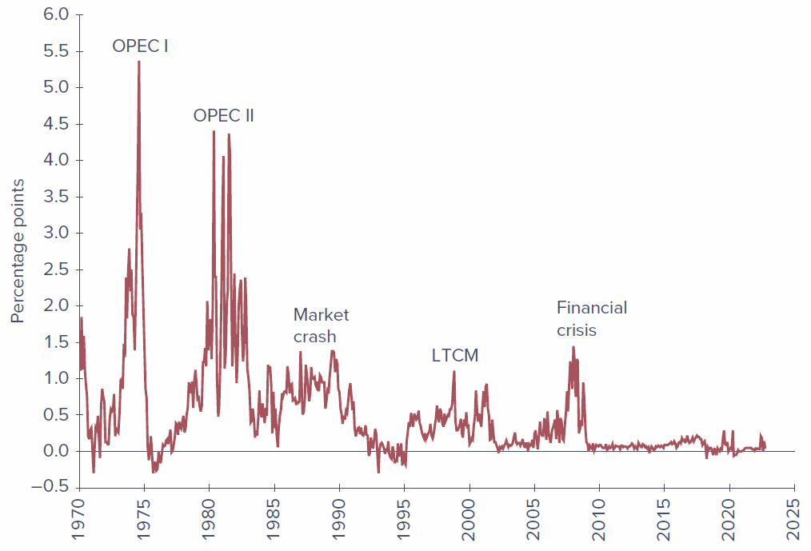
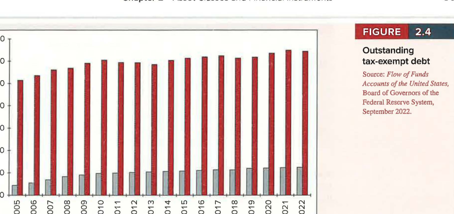
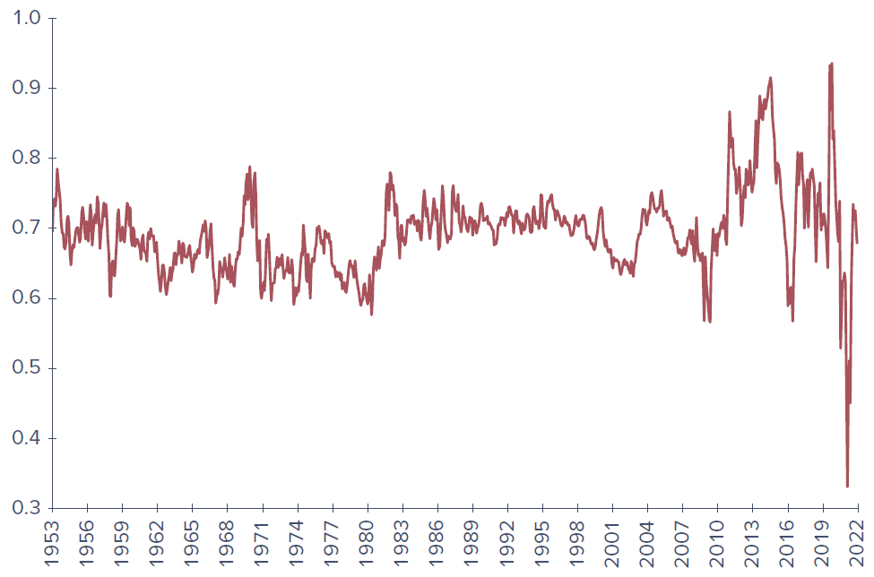
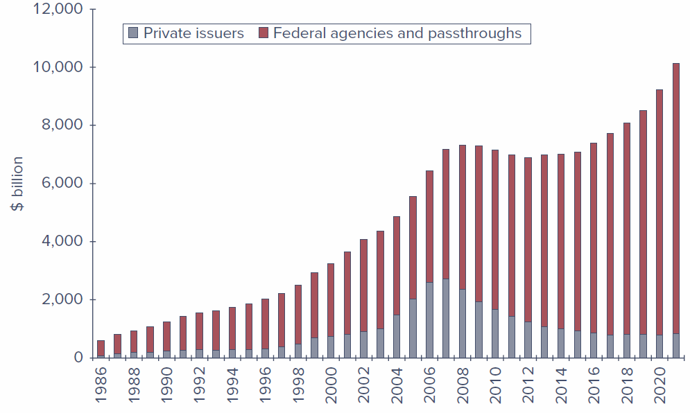
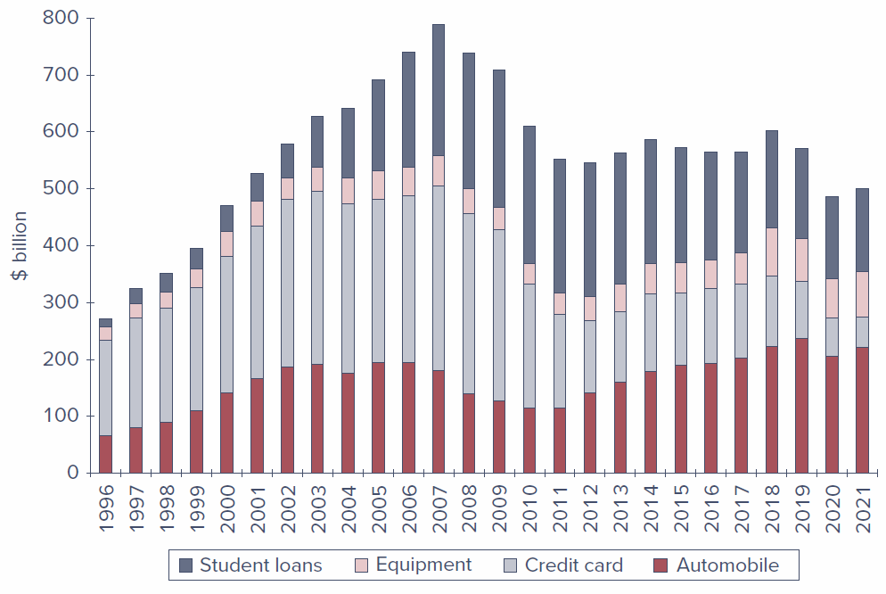
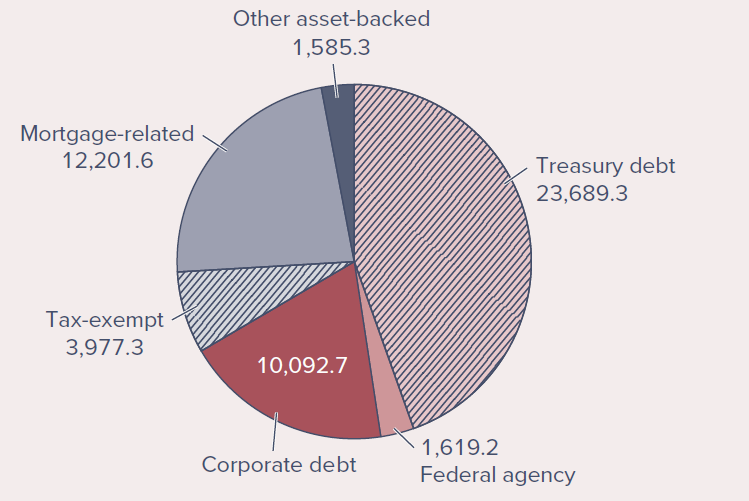

# Learning Objectives

By the end of this chapter, you should be able to:

- **LO 2-1** Describe the differences among the major assets that trade in money markets and in capital markets.
- **LO 2-2** Describe the construction of stock market indexes.
- **LO 2-3** Calculate the profit or loss on investments in options and futures contracts.

## Chapter Roadmap {.unnumbered}

In Chapter 1 we saw that building a portfolio begins with **asset allocation** - deciding how much to place in broad asset classes - followed by **security selection** within each class. This chapter tours those asset classes and the specific instruments that populate them.

Financial markets are traditionally split into two segments:

- The **money market**: short-term, marketable, liquid, low-risk debt securities (often called *cash equivalents*).
- The **capital market**: longer-term and riskier securities, which we further subdivide into (1) longer-term **debt** (bonds), (2) **equity**, and (3) **derivative** markets where options and futures trade.

The table below previews the markets, instruments, and indexes covered in the chapter.

**Table 2.1 - Financial markets and indexes**

| The money market | The bond market | Equity markets | Derivative markets |
|---|---|---|---|
| Treasury bills | Treasury bonds and notes | Common stocks | Options |
| Certificates of deposit | Federal agency debt | Preferred stocks | Futures and forwards |
| Commercial paper | Municipal bonds |  | Swaps |
| Bankers' acceptances | Corporate bonds |  |  |
| Eurodollars | Mortgage-backed securities |  |  |
| Repos and reverses | **Indexes:** Dow Jones averages, S&P indexes, bond-market indicators, international indexes |  |  |
| Federal funds |  |  |  |
| Brokers' calls |  |  |  |

------------------------------------------------------------------------

# 2.1 The Money Market

The **money market** consists of very short-term, highly marketable debt securities. Many of these securities trade in large denominations, placing them out of reach of individual investors directly; **money market mutual funds** solve this by pooling small investors' resources to buy a diversified set of money market instruments on their behalf.

## 2.1.1 Treasury Bills

**U.S. Treasury bills (T-bills)** are the most marketable of all money market instruments. The government borrows by selling bills at a **discount** from their stated face (par) value; at maturity the investor receives the full face value, and the difference is the interest earned.

Key features:

- **Maturities:** issued with initial maturities of 4, 13, 26, or 52 weeks.
- **Denominations:** minimum of only \$100 (versus \$100,000 for most other money market instruments), though \$10,000 denominations are far more common.
- **Liquidity:** very high - easily and cheaply converted to cash with minimal price risk.
- **Taxation:** income is taxable at the federal level but **exempt from state and local taxes**.

**Figure 2.1 - Treasury bill listings** (from *The Wall Street Journal Online*, Sept. 30, 2022):

| Maturity | Days to Maturity | Bid | Asked | Change | Asked Yield |
|---|---|---|---|---|---|
| 11-Oct-22 | 11 | 2.460 | 2.450 | 0.160 | 2.485 |
| 17-Nov-22 | 48 | 2.818 | 2.808 | 0.000 | 2.857 |
| 05-Jan-23 | 97 | 3.168 | 3.158 | 0.007 | 3.229 |
| 20-Apr-23 | 202 | 3.568 | 3.558 | 0.018 | 3.681 |
| 10-Aug-23 | 314 | 3.630 | 3.620 | 0.015 | 3.790 |

The financial press reports **yields**, not prices. The **asked price** is what you pay to buy a bill from a dealer; the **bid price** is the slightly lower price you receive when selling to a dealer; the **bid-asked spread** is the dealer's profit.

**The bank-discount method.** The first columns are quoted using the bank-discount method, which annualizes the discount on a 360-day year and expresses it as a percentage of *face* value:

$$
\text{Ask price} = 1 - \text{ASKED} \times \frac{\text{Days until maturity}}{360}
$$

For the 97-day bill asked at 3.158%, the price is $10{,}000 \times (1 - .03158 \times 97/360) = \$9{,}914.91$ on a \$10,000 face value.

The bank-discount method is flawed for two reasons: it assumes a 360-day year, and it computes the return as a fraction of *face* value rather than the *price actually paid*. The **bond-equivalent yield** in the last column corrects both, annualizing the true gain on a 365-day year:

$$
\text{Bond-equivalent yield} = \frac{10{,}000 - P}{P} \times \frac{365}{n}
$$

For the same bill, the gain over 97 days is $10{,}000/9{,}914.91 = 1.008582$, or .8582%; annualized, $.8582\% \times 365/97 = 3.229\%$.

## 2.1.2 Certificates of Deposit

A **certificate of deposit (CD)** is a **time deposit** with a bank. Unlike demand deposits (checking accounts), time deposits cannot be withdrawn on demand - the bank pays interest and principal only at maturity. CDs above \$100,000 are usually **negotiable** (they can be sold to another investor before maturity). Short-term CDs are highly marketable, though the market thins out for maturities of three months or more. As bank deposits, CDs are **FDIC-insured up to \$250,000** in the event of a bank insolvency.

## 2.1.3 Commercial Paper

**Commercial paper (CP)** is short-term unsecured debt issued directly to the public by large, well-known corporations, in lieu of borrowing from banks. Features:

- **Maturities:** up to 270 days, but most often 1-2 months, usually in multiples of \$100,000 (so small investors participate mainly through money market funds).
- **Safety:** considered fairly safe because a firm's condition can be monitored over such a short horizon; most issues are rated, and CP trades in secondary markets and is quite liquid.
- **Backing:** sometimes supported by a bank line of credit.

**Asset-backed commercial paper.** In the years before the financial crisis, financial firms sharply increased issuance of *asset-backed* CP - short-term paper collateralized by other assets, most notoriously subprime mortgages. When those mortgages began defaulting in 2007, issuers found themselves unable to roll over (refinance) their maturing paper.

## 2.1.4 Bankers' Acceptances

A **bankers' acceptance** begins as an order to a bank by a customer to pay a sum of money at a future date, typically within six months - much like a postdated check. Once the bank stamps the order "**accepted**," it assumes responsibility for payment, and the acceptance can then trade in secondary markets like any other claim on the bank. Because they substitute the bank's creditworthiness for the customer's, acceptances are considered very safe and are widely used in **foreign trade**, where one trader's creditworthiness may be unknown to the other. They sell at a discount from face value, like T-bills.

## 2.1.5 Eurodollars

**Eurodollars** are dollar-denominated deposits held at foreign banks or foreign branches of American banks. By locating outside the United States, these banks escape Federal Reserve regulation. Despite the "Euro" tag, the deposits need not be in Europe. Most are large-sum time deposits of less than six months' maturity. A Eurodollar CD resembles a domestic CD but is the liability of a non-U.S. branch. (Dollar-denominated *Eurobonds* also exist but are excluded from the money market because of their long maturities.)

## 2.1.6 Repos and Reverses

Government-securities dealers use **repurchase agreements (repos, or RPs)** for short-term, usually overnight, borrowing:

- The dealer **sells** securities to an investor with an agreement to **buy them back** the next day at a slightly higher price. The price increase is the overnight interest, and the securities serve as **collateral** - making the repo effectively a collateralized loan with very low credit risk.
- A **term repo** is identical except the implicit loan runs 30 days or more.
- A **reverse repo** is the mirror image: the dealer *buys* securities from an investor with an agreement to *resell* them later at a higher price.

## 2.1.7 Brokers' Calls

Investors who buy stocks **on margin** borrow part of the purchase price from their broker. The broker in turn may borrow from a bank, agreeing to repay on **call** (immediately) if the bank requests it. The rate charged on such loans - the **call money rate** - is typically about one percentage point above the short-term T-bill rate.

## 2.1.8 Federal Funds

Just as households keep deposits at banks, banks keep deposits at the Federal Reserve. Each member bank must maintain a minimum balance in a reserve account with the Fed; funds held there are called **federal funds (fed funds)**. Banks with excess reserves lend to banks with a shortage, usually overnight, at the **federal funds rate**. Although the market arose to help banks meet reserve requirements, the fed funds rate is now watched closely as a key **barometer of monetary policy**.

## 2.1.9 LIBOR and Its Replacements

The **London Interbank Offer Rate (LIBOR)** was, until 2021, the premier short-term rate in the European money market and a reference rate for a vast range of contracts (a borrower might pay "LIBOR plus two points"). More than \$500 trillion of derivatives, plus trillions in floating-rate loans and bonds, were linked to it. Related rates included Euribor and Tibor, quoted across several currencies.

LIBOR's fatal flaw: it was not a rate at which actual transactions occurred but a **survey** of banks' *estimated* borrowing rates - leaving it open to manipulation. In 2012 it emerged that several banks had **colluded** to shade their submissions to profit on derivatives positions, drawing more than \$6 billion in fines. Regulators then decided to replace LIBOR with rates based on **actual** transactions:

- **United States:** the **Secured Overnight Financing Rate (SOFR)** - the rate on overnight repurchase agreements collateralized by Treasury securities.
- **United Kingdom:** SONIA (Sterling Overnight Index Average).
- **Japan:** TONA (Tokyo Overnight Average Rate).
- **Euro area:** ESTER (Euro Short-Term Rate).

Unlike SOFR, several of these are unsecured, but as very short-term loans among highly rated banks they carry minimal credit risk. Because the new benchmarks are overnight rates, longer-term versions require averaging (e.g., the New York Fed publishes 30-, 90-, and 180-day SOFR averages).

## 2.1.10 Yields on Money Market Instruments

Most money market securities are low risk but **not risk-free**. They promise yields above default-free T-bills partly because of greater risk, and partly because investors accept lower yields on the most liquid instruments (like T-bills). Figure 2.2 shows that federal funds have consistently offered a yield premium over T-bills, and that this premium **widens during crises** - the OPEC shocks, the 1987 crash, the 1998 collapse of Long-Term Capital Management, and the 2008-2009 financial crisis. The related **TED spread** (LIBOR minus the T-bill rate) also spiked during the financial crisis and again at the onset of the COVID-19 pandemic in 2020.

{#fig-funds-spread width=85%}

Money market yields are not always directly comparable because quotes differ in (1) whether the return is figured on par value versus investment value, (2) whether a 360- or 365-day year is assumed, and (3) simple versus compound interest. The table below summarizes how each instrument is quoted.

| Money Market Instrument | Instrument Yield |
|---|---|
| Treasury Bills | Discount |
| Certificates of Deposit | Bond Equivalent Yield |
| Commercial Paper | Discount |
| Bankers' Acceptances | Discount |
| Eurodollars | Bond Equivalent Yield |
| Federal Funds | Bond Equivalent Yield |
| Repurchase Agreements | Discount |
| Reverse RPs | Discount |

## 2.1.11 Money Market Funds

**Money market funds** are mutual funds that invest in money market instruments; in 2022 they managed more than \$5 trillion. They usually pose very low risk, but the financial crisis was a traumatic shock. Investors now distinguish between:

- **Government funds** - holding short-term U.S. Treasury or agency securities.
- **Prime funds** - also holding other instruments such as commercial paper or CDs; considered slightly riskier and offering higher yields.

::: {.callout-note appearance="simple"}
**On the Market Front - Money Market Funds and the Financial Crisis of 2008-2009**

Money market funds typically maintain a share value of exactly \$1 and pass all earnings through as interest, so investors treat them as near-substitutes for bank accounts. Until 2008 only one fund had "**broken the buck**" (fallen below \$1 per share). When Lehman Brothers filed for bankruptcy on September 15, 2008, funds holding its commercial paper took large losses, and the next day the **Reserve Primary Fund** broke the buck at \$0.97 per share. A run ensued. The U.S. Treasury temporarily offered to insure money market funds, which calmed the run but put the government on the hook for up to \$3 trillion. Subsequent SEC reforms required institutional funds to "**float**" their share prices and, in 2023, added liquidity-fee triggers and higher minimums for very short-maturity holdings.
:::

------------------------------------------------------------------------

# 2.2 The Bond Market

The **bond market** is composed of longer-term borrowing instruments than those of the money market: Treasury notes and bonds, corporate bonds, municipal bonds, mortgage securities, and federal agency debt. These are often called the **fixed-income capital market** because most promise either a fixed income stream or one set by a formula - though in practice the term "fixed income" is imperfect, so we simply call them debt instruments or bonds.

## 2.2.1 Treasury Notes and Bonds

The U.S. government borrows long-term largely by issuing **Treasury notes** and **Treasury bonds**:

- **T-notes:** original maturities up to 10 years.
- **T-bonds:** original maturities of 20 to 30 years.
- Both may be issued in \$100 increments but commonly trade in \$1,000 denominations, and both make **semiannual coupon payments**.

**Figure 2.3 - Listing of Treasury bond issues** (Sept. 30, 2022):

| Maturity | Coupon | Bid | Asked | Change | Asked Yield to Maturity |
|---|---|---|---|---|---|
| 15-Nov-2022 | 1.625 | 99.8250 | 99.8438 | 0.004 | 2.965 |
| 15-Apr-2023 | 0.25 | 98.0500 | 98.0688 | 0.002 | 3.946 |
| 15-May-2025 | 2.75 | 96.2875 | 96.3000 | -0.018 | 4.254 |
| 15-Oct-2041 | 1.75 | 68.4500 | 68.5125 | -0.870 | 4.178 |
| 15-Oct-2041 | 3.75 | 95.9188 | 95.9813 | -0.930 | 4.057 |
| 15-May-2052 | 2.875 | 83.8875 | 83.9500 | -0.986 | 3.780 |

Prices are quoted as a **percentage of par**. For the highlighted 1.75% bond maturing October 2041, a bid of 68.45 means 68.45% of par, or \$684.50 on a \$1,000 bond; the asked price of 68.5125 means \$685.125. The **change** of -0.870 means the asked price fell .87% of par from the prior day. The **yield to maturity (YTM)** in the last column is the annualized rate of return to an investor who buys at the asked price and holds to maturity, accounting for both coupon income and the gain to par (covered in detail in Chapter 10).

::: {.callout-tip appearance="simple"}
**Concept Check 2.1** - Using Figure 2.3, what were the bid price, asked price, and yield to maturity of the 2.75% coupon May 2025 Treasury bond? What was its asked price the previous day? *(Solution at the end.)*
:::

## 2.2.2 Inflation-Protected Treasury Bonds

The least-risky place to start a portfolio is at the government-debt end of the spectrum, and many governments issue bonds linked to the **cost of living** to help investors hedge inflation. In the U.S. these are **TIPS (Treasury Inflation Protected Securities)**: the principal is adjusted in proportion to increases in the **Consumer Price Index**, so the bonds provide a constant stream of income in **real** (inflation-adjusted) dollars, and the real interest rate is risk-free if held to maturity. In quote sheets they are marked with a trailing "i."

## 2.2.3 Federal Agency Debt

Some government agencies issue their own securities to channel credit to sectors Congress believes are underserved by private markets. The major mortgage-related agencies are the **Federal Home Loan Bank (FHLB)**, the **Federal National Mortgage Association (FNMA, or Fannie Mae)**, the **Government National Mortgage Association (GNMA, or Ginnie Mae)**, and the **Federal Home Loan Mortgage Corporation (FHLMC, or Freddie Mac)**.

Although agency debt was never *explicitly* insured, markets long assumed the government would step in - a belief validated in September 2008, when Fannie Mae and Freddie Mac, on the brink of insolvency, were placed into **conservatorship** under the Federal Housing Finance Agency, and their bonds were made good.

## 2.2.4 International Bonds

Firms borrow abroad and investors buy foreign bonds through a thriving international capital market centered largely in London:

- A **Eurobond** is a bond denominated in a currency *other than* that of the country where it is issued (e.g., a dollar-denominated bond sold in Britain is a *Eurodollar bond*; yen-denominated bonds sold outside Japan are *Euroyen bonds*). Because "Euro" is confusing, think of these simply as international bonds.
- In contrast, some bonds are issued **in a foreign country but in the investor's currency**: a **Yankee bond** is a dollar-denominated bond sold in the U.S. by a non-U.S. issuer; **Samurai bonds** are yen-denominated bonds sold in Japan by non-Japanese issuers.

## 2.2.5 Municipal Bonds

**Municipal bonds ("munis")** are issued by state and local governments and resemble Treasury and corporate bonds, except that their **interest income is exempt from federal income tax** (and usually from state and local tax in the issuing state). Capital gains taxes still apply if a muni is sold or matures above the purchase price. Two main types:

- **General obligation bonds** - backed by the "full faith and credit" (the taxing power) of the issuer.
- **Revenue bonds** - issued to finance specific projects (airports, hospitals, turnpikes, port authorities) and backed only by that project's revenues; therefore **riskier** in terms of default than general obligation bonds.

An **industrial development bond** is a revenue bond issued to finance commercial enterprises (e.g., a factory operated by a private firm), giving the firm access to the municipality's tax-exempt borrowing rate (subject to federal limits). Municipal maturities range up to 30 years; short-term **tax anticipation notes** raise funds ahead of tax collections.

{#fig-muni-debt width=80%}

**The equivalent taxable yield.** Because muni interest escapes tax, investors compare after-tax returns. Let $t$ be the investor's combined federal-plus-local marginal tax rate and $r_{\text{taxable}}$ the before-tax yield on a taxable bond. Then the after-tax taxable yield is $r_{\text{taxable}}(1-t)$. Setting after-tax yields equal gives the **equivalent taxable yield** - the rate a taxable bond must offer to match a muni:

$$
r_{\text{taxable}}(1-t) = r_{\text{muni}} \qquad (2.1)
$$

$$
r_{\text{taxable}} = \frac{r_{\text{muni}}}{1-t} \qquad (2.2)
$$

**Table 2.2 - Equivalent taxable yields for various tax-exempt yields**

| Marginal Tax Rate | 1% | 2% | 3% | 4% | 5% |
|---|---|---|---|---|---|
| 20% | 1.25% | 2.50% | 3.75% | 5.00% | 6.25% |
| 30% | 1.43 | 2.86 | 4.29 | 5.71 | 7.15 |
| 40% | 1.67 | 3.33 | 5.00 | 6.67 | 8.33 |
| 50% | 2.00 | 4.00 | 6.00 | 8.00 | 10.00 |

The equivalent taxable yield rises with the tax bracket - the higher the bracket, the more valuable the exemption - which is why high-bracket investors tend to hold munis. Rearranging equation 2.1 gives the **cutoff (break-even) tax bracket** at which an investor is indifferent between taxable and tax-exempt bonds:

$$
t = 1 - \frac{r_{\text{muni}}}{r_{\text{taxable}}} \qquad (2.3)
$$

The **yield ratio** $r_{\text{muni}}/r_{\text{taxable}}$ is a key driver of muni attractiveness: the higher the ratio, the lower the cutoff bracket, and the more investors prefer munis. Figure 2.5 plots this ratio (versus Baa-rated corporate debt); it has hovered around 0.70 for most of the past 40 years, implying a cutoff bracket near $1 - 0.70 = 0.30$, or 30%.

{#fig-yield-ratio width=85%}

::: {.callout-note appearance="simple"}
**Example 2.1 - Taxable versus Tax-Exempt Yields**

With the ratio around 0.70, equation 2.3 implies that an investor whose combined bracket exceeds 30% earns a higher after-tax yield from municipals. Because it is hard to control precisely for differences in risk between the bonds, this cutoff is approximate.
:::

::: {.callout-tip appearance="simple"}
**Concept Check 2.2** - In a 30% combined bracket, would you prefer a 6% taxable return or a 4% tax-free yield? What is the equivalent taxable yield of the 4% tax-free yield? *(Solution at the end.)*
:::

## 2.2.6 Corporate Bonds

**Corporate bonds** are how firms borrow directly from the public. Structured much like Treasuries - semiannual coupons, face value returned at maturity - they differ chiefly by carrying **default risk** (covered in Chapter 10). By claim priority in bankruptcy:

- **Secured bonds** - backed by specific collateral.
- **Debentures** - unsecured, no specific collateral.
- **Subordinated debentures** - lower-priority claim on assets.

Corporate bonds may carry embedded options: **callable bonds** let the firm repurchase the bond at a stipulated call price, while **convertible bonds** let the holder convert each bond into a set number of shares (covered in Part Three). By credit quality, bonds are classified as **investment grade** versus **speculative (high-yield) grade**.

## 2.2.7 Mortgage- and Asset-Backed Securities

A **mortgage-backed security** is an ownership claim in a pool of mortgages (or an obligation secured by such a pool); owners receive the "**pass-through**" of the pool's monthly principal and interest. Traditionally, pass-throughs were built from **conforming mortgages** meeting underwriting standards for purchase by Fannie Mae or Freddie Mac. Leading up to the crisis, however, large amounts of **subprime mortgages** (riskier loans to weaker borrowers) were bundled and sold by "private-label" issuers.

{#fig-mbs width=85%}

Encouraged to expand affordable housing, the government-sponsored enterprises bought subprime mortgage securities that proved disastrous, generating trillion-dollar losses across banks, hedge funds, Fannie, and Freddie. From 2007, the private-label pass-through market shrank rapidly (Figure 2.6).

Despite these troubles, **securitization** is now common well beyond mortgages: car loans, student loans, home equity loans, credit card receivables, and even corporate debt are bundled into tradable pass-through securities. Figure 2.7 shows the rapid pre-2007 growth of nonmortgage asset-backed securities; the market contracted after the crisis and again during COVID-19 but remains substantial.

{#fig-abs width=85%}

------------------------------------------------------------------------

# 2.3 Equity Securities

## 2.3.1 Common Stock as Ownership Shares

**Common stocks** (equities) represent **ownership shares** in a corporation. Each share entitles its owner to one vote on matters of corporate governance at the annual meeting and to a share of the financial benefits of ownership (such as any dividends the firm chooses to pay).

A corporation is controlled by a **board of directors** elected by shareholders; the board hires managers to run the firm day to day and is charged with overseeing management in shareholders' interests. Shareholders who cannot attend the annual meeting may vote by **proxy**, empowering another party to vote in their name. Because management usually collects the vast majority of proxies, it typically enjoys considerable discretion - which can create **agency problems** (managers pursuing goals not aligned with shareholders). Mechanisms that mitigate agency problems include performance-based compensation, board and outside oversight, the threat of a **proxy contest**, and the threat of a **takeover**. A firm whose stock is not publicly traded is said to be **private**.

## 2.3.2 Characteristics of Common Stock

Two features define common stock as an investment:

- **Residual claim** - stockholders are **last in line** among claimants. In liquidation they receive what remains after all others (tax authorities, employees, suppliers, bondholders, other creditors) are paid; in a going concern they have claim to operating income left after interest and taxes, which management may pay out as dividends or reinvest.
- **Limited liability** - the most a shareholder can lose is the original investment. Unlike owners of unincorporated businesses, shareholders are not personally liable for the firm's obligations; at worst, their stock becomes worthless.

::: {.callout-tip appearance="simple"}
**Concept Check 2.3** - (a) If you buy 100 shares of Intel common stock, to what are you entitled? (b) What is the most money you can make over the next year? (c) If you pay \$30 per share, what is the most you could lose over the year? *(Solution at the end.)*
:::

## 2.3.3 Stock Market Listings

**Figure 2.8 - Listing of stocks traded on the New York Stock Exchange** (Oct. 8, 2022):

| Name | Symbol | Close | Change | Volume | 52-wk High | 52-wk Low | Div | Yield | P/E |
|---|---|---|---|---|---|---|---|---|---|
| Herbalife Nutrition | HLF | 19.93 | -0.66 | 716,359 | 47.86 | 19.30 | - | - | 6.21 |
| Hershey | HSY | 220.52 | -0.13 | 947,288 | 234.56 | 172.72 | 4.14 | 1.88 | 28.06 |
| Hess Corp | HES | 128.20 | -2.18 | 3,077,418 | 131.83 | 68.32 | 1.50 | 1.17 | 27.16 |
| Hewlett Packard | HPE | 12.46 | -0.45 | 12,885,403 | 17.76 | 11.90 | 0.48 | 3.85 | 4.45 |
| Home Depot | HD | 284.32 | -6.07 | 2,405,956 | 420.61 | 264.51 | 7.60 | 2.67 | 17.46 |
| Honda | HMC | 22.31 | -0.21 | 1,196,641 | 32.15 | 21.53 | - | - | 8.20 |
| Honeywell | HON | 171.41 | -3.63 | 2,959,695 | 228.26 | 166.63 | 4.12 | 2.40 | 23.38 |

Consider the highlighted **Hershey (HSY)** listing: it closed at \$220.52, down \$0.13 from the prior day, on about 947,000 shares. The **dividend yield** - annual dividend per dollar of price - is $\$4.14/\$220.52 = 1.88\%$. Dividend yield captures only part of a stock's return; it ignores prospective **capital gains** (or losses). Low-dividend firms presumably offer greater capital-gain prospects, and yields vary widely across firms.

The **P/E ratio** (price-to-earnings) is the current price divided by last year's earnings per share - how much buyers pay per dollar of earnings. Hershey's P/E is 28.06. Where dividend yield or P/E is blank, the firm pays no dividend or has zero/negative earnings.

## 2.3.4 Preferred Stock

**Preferred stock** blends features of equity and debt. Like a bond, it promises a **fixed stream of income** each year - resembling an infinite-maturity bond (a perpetuity) - and, also like a bond, it carries **no voting power**.

Yet preferred is an **equity** investment: the firm has **no contractual obligation** to pay preferred dividends, and failure to pay does *not* trigger bankruptcy (unlike missed interest on debt). Preferred dividends are usually **cumulative** - unpaid dividends accumulate and must be paid in full before any common dividend.

- **Tax treatment:** preferred dividends are *not* tax-deductible for the issuing firm (unlike bond interest). But corporations may **exclude 50%** of dividends received from domestic corporations when computing taxable income, which makes preferred an attractive fixed-income holding for **other corporations** - individual investors, who cannot use the exclusion, generally find preferred yields unattractive. (The publisher's slides note this exclusion; students should confirm the current statutory percentage.)
- **Priority:** preferred ranks after bonds but before common in bankruptcy, yet often sells at lower yields, reflecting the value of the corporate dividend exclusion.
- **Variations:** preferred can be **redeemable** (callable), **convertible** into common, or **adjustable-rate** (dividend tied to current market rates).

## 2.3.5 Depositary Receipts

**American Depositary Receipts (ADRs)** are certificates traded in U.S. markets that represent ownership in the shares of a foreign company. Each ADR may correspond to a fraction of a share, one share, or several shares. Created to help foreign firms meet U.S. registration requirements, ADRs are the most common way for U.S. investors to directly invest in and trade foreign corporations' shares.

------------------------------------------------------------------------

# 2.4 Stock and Bond Market Indexes

## 2.4.1 Stock Market Indexes

The **Dow Jones Industrial Average** is a staple of the evening news, but it is only one of many indicators and far from the best. Broader indexes are published daily, along with several bond-market indexes and foreign indexes (e.g., the **Nikkei** of Tokyo, the **Financial Times** index of London). Market benchmark portfolios matter for both portfolio construction and performance evaluation. Indexes differ primarily in their **weighting scheme**: price-weighted, market value-weighted, or equally weighted.

## 2.4.2 The Dow Jones Industrial Average

The **DJIA** tracks 30 large "blue-chip" firms and has been computed since 1896. It is a **price-weighted average**: originally the sum of the 30 share prices divided by 30, so the percentage change in the average equals the percentage change in a portfolio holding **one share of each** stock. Because the investment in each firm is proportional to its **share price**, high-priced stocks dominate the average.

The following tables underpin the worked examples below.

**Table 2.3 - Data to construct stock price indexes**

| Stock | Initial Price | Final Price | Shares (millions) | Initial Value (\$M) | Final Value (\$M) |
|---|---|---|---|---|---|
| ABC | \$25 | \$30 | 20 | \$500 | \$600 |
| XYZ | \$100 | \$90 | 1 | \$100 | \$90 |
| **Total** |  |  |  | **\$600** | **\$690** |

**Table 2.4 - Data to construct stock price indexes after a stock split** (XYZ splits 2-for-1)

| Stock | Initial Price | Final Price | Shares (millions) | Initial Value (\$M) | Final Value (\$M) |
|---|---|---|---|---|---|
| ABC | \$25 | \$30 | 20 | \$500 | \$600 |
| XYZ | \$50 | \$45 | 1 | \$100 | \$90 |
| **Total** |  |  |  | **\$600** | **\$690** |

::: {.callout-note appearance="simple"}
**Example 2.2 - Price-Weighted Average**

Using Table 2.3, a portfolio holding one share of each firm starts at $\$25 + \$100 = \$125$ and ends at $\$30 + \$90 = \$120$, a **-4%** change. The price-weighted index starts at $(25+100)/2 = 62.5$ and ends at $(30+90)/2 = 60$, also **-4%**. Although ABC rose 20% while XYZ fell only 10%, the index dropped, because the higher-priced XYZ carries four times the weight of ABC. A high-priced stock can dominate a price-weighted average.
:::

::: {.callout-note appearance="simple"}
**Example 2.3 - Splits and Price-Weighted Averages**

If XYZ splits 2-for-1, its price falls to \$50 but the average should not fall. To keep the index unchanged, the **divisor** is reduced: solve $(25+50)/d = 62.5$, giving $d = 1.20$ (down from 2.0). At period-end, ABC = \$30 and XYZ = \$45 (the same -10% return), so the average is $(30+45)/1.20 = 62.5$ - unchanged, a 0% return rather than the -4% before the split. The split lowers the weight of the poorer-performing XYZ, so the implicit weighting of a price-weighted average is somewhat arbitrary. Substitutions of one firm for another also require a divisor update; by early 2023 the DJIA divisor had fallen to about **0.152**.
:::

::: {.callout-tip appearance="simple"}
**Concept Check 2.4** - Suppose XYZ's final price in Table 2.3 rises to \$110 while ABC falls to \$20. Find the percentage change in the price-weighted average, and compare it to the return on a portfolio holding one share of each company. *(Solution at the end.)*
:::

Because the Dow relies on so few firms, its composition is revised periodically to stay representative. Table 2.5 contrasts the 1928 and 2023 members - striking evidence of a century of economic change, as many "bluest of the blue chip" 1928 firms no longer exist.

**Table 2.5 - Companies in the Dow Jones Industrial Average: 1928 and 2023**

| Dow Industrials in 1928 | Current Dow Company | Ticker | Industry | Year Added |
|---|---|---|---|---|
| Allied Chemical | American Express | AXP | Consumer finance | 1982 |
| American Can | Procter & Gamble | PG | Household products | 1932 |
| American Smelting | Salesforce.com | CRM | Business software | 2020 |
| American Sugar | Amgen | AMGN | Drug manufacturers | 2020 |
| American Tobacco | Goldman Sachs | GS | Investment banking | 2013 |
| Atlantic Refining | Johnson & Johnson | JNJ | Pharmaceuticals | 1997 |
| Bethlehem Steel | McDonald's | MCD | Restaurants | 1985 |
| Chrysler | IBM | IBM | Computer services | 1979 |
| General Electric | Honeywell Int'l | HON | Industrial machinery | 2020 |
| General Motors | Intel | INTC | Semiconductors | 1999 |
| General Railway Signal | Merck | MRK | Pharmaceuticals | 1979 |
| Goodrich | Verizon | VZ | Telecommunications | 2004 |
| International Harvester | Chevron | CVX | Oil and gas | 2008 |
| International Nickel | Caterpillar | CAT | Construction | 1991 |
| Mack Trucks | Microsoft | MSFT | Software | 1999 |
| Nash Motors | UnitedHealth Group | UNH | Health insurance | 2012 |
| North American | Apple | AAPL | Electronic equipment | 2015 |
| Paramount Publix | JPMorgan Chase | JPM | Banking | 1991 |
| Postum Inc | Travelers | TRV | Insurance | 2009 |
| Radio Corp | Visa | V | Electronic payments | 2013 |
| Sears Roebuck | Home Depot | HD | Home improvement retailers | 1999 |
| Standard Oil (NJ) | DowDuPont | DWDP | Chemicals | 1935 |
| Texas Corp | Disney | DIS | Broadcasting and entertainment | 1991 |
| Texas Gulf Sulphur | Coca-Cola | KO | Beverages | 1987 |
| Union Carbide | Nike | NKE | Apparel | 2013 |
| U.S. Steel | Walmart | WMT | Retailers | 1997 |
| Victor Talking Machine | Boeing | BA | Aerospace and defense | 1987 |
| Westinghouse | Cisco Systems | CSCO | Computer equipment | 2009 |
| Wright Aeronautical | 3M | MMM | Diversified industrials | 1976 |
| Woolworth | Walgreens Boots | WBA | Pharmaceuticals | 2018 |

## 2.4.3 The Standard & Poor's 500 Index

The **S&P 500** improves on the Dow in two ways: it is broader (about 500 firms), and it is a **market value-weighted index**. Weights are proportional to each firm's total **market value** (price times shares), so a firm with five times the market value receives five times the weight. The index equals the total market value of its firms relative to a base, and its return equals the return on a portfolio holding all firms **in proportion to market value** (excluding cash dividends).

::: {.callout-note appearance="simple"}
**Example 2.4 - Value-Weighted Indexes**

Using Table 2.3, total market value rises from \$600M to \$690M. Setting the base index to 100, year-end value is $100 \times (690/600) = 115$ - a **+15%** return, matching a market-value-weighted portfolio. Unlike the price-weighted index (which fell because high-priced XYZ dominated), the value-weighted index **rose**, because it gives more weight to ABC, the larger-market-value stock. Value-weighted indexes are also **unaffected by stock splits**: XYZ's total market value is unchanged by a split.
:::

::: {.callout-tip appearance="simple"}
**Concept Check 2.5** - Reconsider XYZ and ABC from Concept Check 2.4. Calculate the percentage change in the market value-weighted index, and compare it to a portfolio holding \$500 of ABC for every \$100 of XYZ. *(Solution at the end.)*
:::

Investors can buy index exposure cheaply via **index funds** (mutual funds holding shares in index proportions) or **exchange-traded funds (ETFs)**, which trade as a single unit and range from broad global indexes to narrow industry indexes (covered in Chapter 4). Most modern value-weighted indexes actually weight by **free float** - only shares freely tradable among investors, excluding those held by founding families or governments.

## 2.4.4 Russell Indexes

The **Russell indexes** are a family segmented primarily by size (market capitalization):

- **Russell 3000** - the largest 3,000 U.S. stocks.
- **Russell 1000** - the largest 1,000 firms in the Russell 3000.
- **Russell 2500** - the bottom 2,500 of the Russell 3000 (popular for mid- to small-cap).
- Also the **Russell Top 200**, **Top 50**, and the **Russell Microcap** (stocks ranked 2,001-4,000).

Their constituents are updated once a year, and the indexes are capitalization weighted.

## 2.4.5 Other U.S. Market Value Indexes

- The **NYSE** publishes a market value-weighted composite of all NYSE-listed stocks, plus industrial, utility, transportation, and financial subindexes.
- **Nasdaq** computes a Composite index of firms on its market; the **Nasdaq 100** is a subset of larger firms accounting for much of the Composite's capitalization.
- The most inclusive U.S. equity index is the **FT (Financial Times) Wilshire 5000**, covering essentially all actively traded U.S. stocks (once over 5,000 stocks; today about 3,700). A similar comprehensive index is published by **CRSP** (Center for Research in Security Prices, University of Chicago).

## 2.4.6 Equally Weighted Indexes

An **equally weighted index** averages the returns of each stock with equal weight, corresponding to a portfolio that places **equal dollar amounts** in each stock. This differs from price weighting (equal *shares*) and value weighting (dollars proportional to market value). Crucially, an equally weighted index does **not** correspond to a buy-and-hold strategy: as prices move, dollar weights drift, so maintaining equal weights requires **rebalancing** (selling winners and/or buying losers) each period.

## 2.4.7 Foreign and International Stock Market Indexes

Major foreign indexes include the **Nikkei** (Japan), **FTSE** (U.K., "footsie"), **DAX** (Germany), **Hang Seng** (Hong Kong), and **TSX** (Toronto). A leader in international index construction is **MSCI (Morgan Stanley Capital International)**, which computes dozens of country and regional indexes.

**Table 2.6 - Sample of MSCI stock indexes**

| | Developed Markets | Emerging Markets |
|---|---|---|
| **Regional indexes** | EAFE (Europe, Australasia, Far East), EMU, Europe, Far East, Kokusai (World ex-Japan), Nordic Countries, North America, World, World ex-U.S. | Emerging Markets (EM), EM Asia, EM Eastern Europe, EM Europe, EM Europe and Middle East, EM Far East, EM Latin America |
| **Country indexes** | Australia, Austria, Belgium, Canada, Denmark, Finland, France, Germany, Hong Kong, Ireland, Israel, Italy, Japan, Netherlands, New Zealand, Norway, Portugal, Singapore, Spain, Sweden, Switzerland, U.K., U.S. | Brazil, Chile, China, Colombia, Czech Republic, Egypt, Greece, Hungary, India, Korea, Malaysia, Mexico, Peru, Philippines, Poland, Russia, South Africa, Taiwan, Thailand, Turkey |

## 2.4.8 Bond Market Indicators

Several **bond market indexes** measure performance across bond categories - the best known are those of **Merrill Lynch**, **Barclays**, and the **Citi Broad Investment Grade Bond Index**. Figure 2.9 shows the components of the U.S. fixed-income market near the close of 2022. A key challenge for these indexes is that many bonds **trade infrequently**, so reliable up-to-date prices are hard to obtain; some prices must be estimated from bond-valuation models (so-called **matrix values**), which may differ from actual market prices.

{#fig-fixed-income width=80%}

------------------------------------------------------------------------

# 2.5 Derivative Markets

Futures, options, and related **derivative contracts** provide payoffs that depend on the values of other variables - commodity prices, bond and stock prices, interest rates, or index values. Because their values **derive from** those of other assets, they are called **derivative assets** (or contingent claims), covered in detail in Part Five.

## 2.5.1 Options

- A **call option** gives its holder the **right to buy** an asset at a specified **exercise (strike) price** on or before an **expiration date**. Each contract covers 100 shares. The holder exercises only if the market price **exceeds** the exercise price; otherwise the option expires worthless. Calls therefore gain value as the underlying price rises (a bullish vehicle).
- A **put option** gives its holder the **right to sell** an asset at the exercise price on or before expiration. Puts gain value as the underlying price **falls**; the holder exercises only when able to deliver an asset worth less than the exercise price.

**Figure 2.10 - Stock options on Microsoft** (Oct. 7, 2022; Microsoft closed at \$234.14):

| Expiration | Strike | Call | Put |
|---|---|---|---|
| 21-Oct-2022 | 230 | 9.40 | 4.92 |
| 21-Oct-2022 | 235 | 6.47 | 7.05 |
| 21-Oct-2022 | 240 | 4.15 | 9.75 |
| 18-Nov-2022 | 230 | 14.87 | 10.22 |
| 18-Nov-2022 | 235 | 12.05 | 12.40 |
| 18-Nov-2022 | 240 | 9.50 | 14.90 |

Two patterns emerge from the listing:

- **Call prices fall, and put prices rise, as the strike increases.** The October 235 call last traded at \$6.47 (so one contract on 100 shares costs \$647); the 240 call costs only \$4.15, because the right to buy at a higher price is less valuable. Conversely, the 235 put costs \$7.05 while the 240 put costs \$9.75.
- **Both calls and puts cost more with more time to expiration.** The 235 call expiring November 18 (\$12.05) costs more than the October 21 call (\$6.47).

::: {.callout-tip appearance="simple"}
**Concept Check 2.6** - What is the per-share profit or loss to an investor who buys the October Microsoft call with exercise price \$235 if the stock is \$245 at expiration? What about a buyer of the put with the same exercise price and expiration? *(Solution at the end.)*
:::

## 2.5.2 Futures Contracts

A **futures contract** calls for **delivery** of an asset (or its cash value) at a specified maturity date, for an agreed-upon **futures price** also paid at maturity. The **long position** commits to *purchasing* the asset; the **short position** commits to *delivering* it. The long gains when prices rise; the short's loss equals the long's gain.

**Figure 2.11 - Corn futures prices** on the Chicago Mercantile Exchange (Oct. 7, 2022; each contract = 5,000 bushels):

| Maturity | Last | Change | High | Low |
|---|---|---|---|---|
| Dec-22 | 6.8300 | 0.0500 | 6.8450 | 6.7140 |
| Mar-23 | 6.9050 | 0.0725 | 6.9175 | 6.7900 |
| May-23 | 6.9150 | 0.0675 | 6.9300 | 6.8075 |
| Dec-23 | 6.2425 | 0.0350 | 6.2500 | 6.1750 |
| Jul-24 | 6.3000 | 0.0475 | 5.6400 | 5.6600 |

The front (nearest) contract, December 2022, last traded at \$6.83 per bushel. If corn sells for \$6.85 at expiration, the long earns $5{,}000 \times (\$6.85 - \$6.83) = \$100$, while the short loses the same amount.

**Options versus futures.** The crucial distinction is **right versus obligation**. A futures contract **obliges** the long to buy at the futures price; a call option merely **conveys the right** to buy at the exercise price - exercised only if the asset is worth more. The call holder therefore has a better position than a long future at the same price, but this advantage has a cost: options must be **purchased** (the price is the **premium**), whereas futures are entered **without cost**. Similarly, a put differs from a short futures position by conveying the **right**, rather than the **obligation**, to sell.

------------------------------------------------------------------------

# Concept Check Solutions

**2.1** The bid price is 96.2875% of par = \$962.875; the asked price is 96.30% = \$963.00, corresponding to a yield of 4.254%. The ask price fell 0.018 from the prior day, so it was 96.318, or \$963.18, yesterday.

**2.2** A 6% taxable return is equivalent to an after-tax return of $6\%(1-.30) = 4.2\%$, so you would be better off in the taxable bond. The equivalent taxable yield of the 4% tax-free bond is $4\%/(1-.3) = 5.71\%$ - a taxable bond would need to pay 5.71% to match a 4% tax-free yield.

**2.3** (a) You are entitled to a prorated share of Intel's dividend payments and to vote in stockholder meetings. (b) Your potential gain is unlimited, because the stock price has no upper bound. (c) Your outlay was $\$30 \times 100 = \$3{,}000$; because of limited liability, that is the most you can lose.

**2.4** The price-weighted index rises from $62.50\;[=(100+25)/2]$ to $65\;[=(110+20)/2]$, a gain of 4%. A one-share-each portfolio requires \$125 and grows to \$130, a return of $4\%\;(=5/125)$ - equal to the index return.

**2.5** The market-value-weighted return equals the change in the stock portfolio's value. Starting value is $\$100M + \$500M = \$600M$; it falls to $\$110M + \$400M = \$510M$, a loss of $90/600 = 15\%$. The index-portfolio return is a value-weighted average of the two stock returns (weights 1/6 on XYZ and 5/6 on ABC): $(1/6)(10\%) + (5/6)(-20\%) = -15\%$, equal to the value-weighted index return.

**2.6** The call payoff is $\$245 - \$235 = \$10$; since the call cost \$6.47, the profit is $\$10 - \$6.47 = \$3.53$ per share. The put expires worthless (the stock exceeds the exercise price), so the loss is its cost, \$7.05 per share.

------------------------------------------------------------------------

# Summary

- **Money market securities** are very short-term debt obligations - highly marketable, low credit risk, minimal price risk, often in large denominations (accessible to small investors through money market funds).
- Much of U.S. **government borrowing** takes the form of coupon-paying Treasury bonds and notes, issued at or near par and similar in design to corporate bonds.
- **Municipal bonds** are distinguished by their tax-exempt interest; the equivalent taxable yield is $r_{\text{muni}}/(1-t)$.
- **Mortgage pass-through securities** pool mortgages and pass principal and interest to owners; government agency pass-throughs are guaranteed, but private-label pools are not.
- **Common stock** is an ownership share with one vote per share and a prorated claim on dividends; stockholders are residual claimants.
- **Preferred stock** pays a fixed (usually cumulative) dividend but does not trigger bankruptcy if unpaid; adjustable-rate preferred indexes its dividend to a short-term rate.
- Many **stock market indexes** measure overall performance. The Dow Jones averages are price-weighted; broad modern indexes (S&P 500, Nasdaq, Wilshire 5000, Nikkei, FTSE, DAX) are market value-weighted.
- A **call option** is the right to buy at a stipulated exercise price; a **put option** is the right to sell. Calls gain and puts lose value as the underlying rises.
- A **futures contract** is an obligation to buy (long) or sell (short) at a stipulated futures price on a maturity date; the long gains and the short loses when the asset value rises.

------------------------------------------------------------------------

# Key Terms

Below are the chapter's key terms with the textbook's margin definitions.

- **Bankers' acceptance** - An order to a bank by a customer to pay a sum of money at a future date.
- **Call option** - The right to buy an asset at a specified exercise price on or before a specified expiration date.
- **Certificate of deposit** - A bank time deposit.
- **Commercial paper** - Short-term unsecured debt issued by large corporations.
- **Common stocks** - Ownership shares in a publicly held corporation. Shareholders have voting rights and may receive dividends.
- **Corporate bonds** - Long-term debt issued by private corporations typically paying semiannual coupons and returning the face value of the bond at maturity.
- **Derivative asset** - A security with a payoff that depends on the prices of other securities.
- **Equally weighted index** - An index computed from a simple average of returns.
- **Eurodollars** - Dollar-denominated deposits at foreign banks or foreign branches of American banks.
- **Federal funds** - Funds in the accounts of commercial banks at the Federal Reserve Bank.
- **Futures contract** - Obliges traders to purchase or sell an asset at an agreed-upon price at a specified future date.
- **London Interbank Offer Rate (LIBOR)** - Lending rate among banks in the London market.
- **Market value-weighted index** - Index return equals the weighted average of the returns of each component security, with weights proportional to outstanding market value.
- **Money market** - Includes short-term, highly liquid, and relatively low-risk debt instruments.
- **Municipal bonds** - Tax-exempt bonds issued by state and local governments.
- **Preferred stock** - Nonvoting shares in a corporation, usually paying a fixed stream of dividends.
- **Price-weighted average** - An average computed by adding the prices of the stocks and dividing by a "divisor."
- **Put option** - The right to sell an asset at a specified exercise price on or before a specified expiration date.
- **Repurchase agreements (repos)** - Short-term sales of securities with an agreement to repurchase the securities at a higher price.
- **Secured Overnight Financing Rate (SOFR)** - Rate on collateralized overnight repurchase agreements.
- **Treasury bills** - Short-term government securities issued at a discount from face value and returning the face amount at maturity.
- **Treasury bonds** - Debt obligations of the federal government with original maturities greater than 10 years.
- **Treasury notes** - Debt obligations of the federal government with original maturities from 2 to 10 years.

------------------------------------------------------------------------

## Looking Ahead {.unnumbered}

**Chapter 3 - How Securities Are Traded:** how firms issue securities, how those securities subsequently trade in secondary markets, the mechanics of buying on margin and short selling, and the regulation of securities markets.

*Source: Bodie, Kane, and Marcus, Essentials of Investments (2024 Release), Chapter 2, "Asset Classes and Financial Instruments." Figures reproduced from the chapter and the publisher's slides.*
