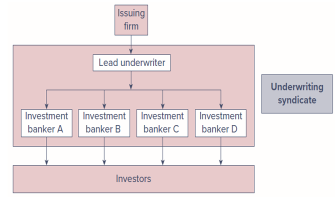
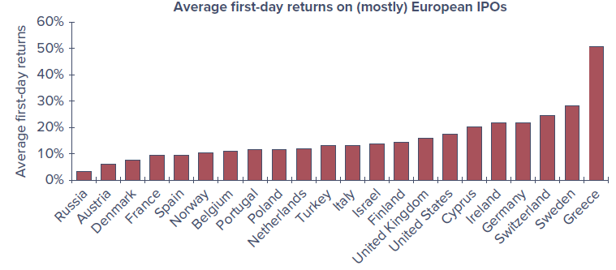
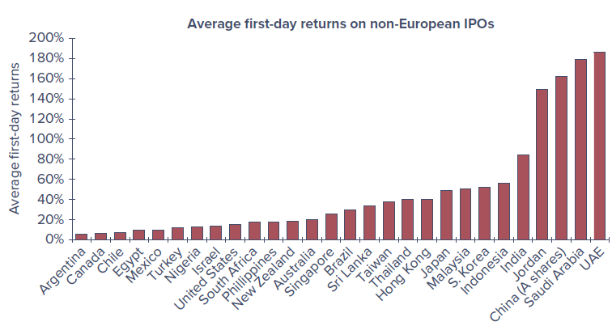
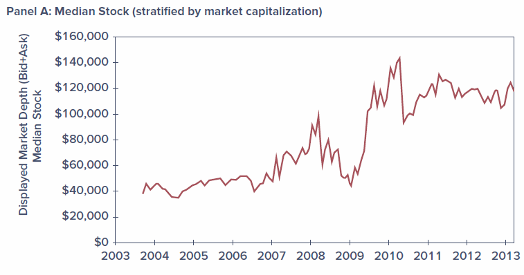
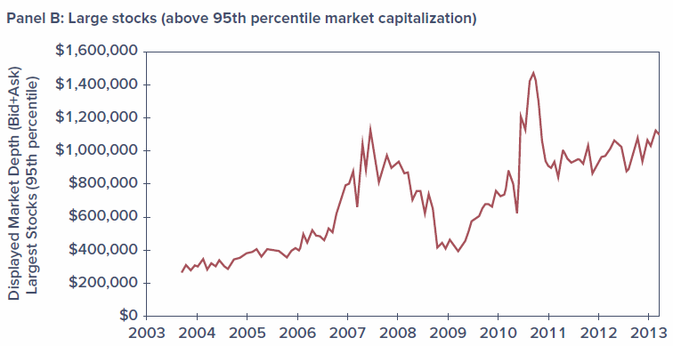
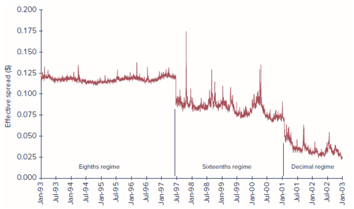
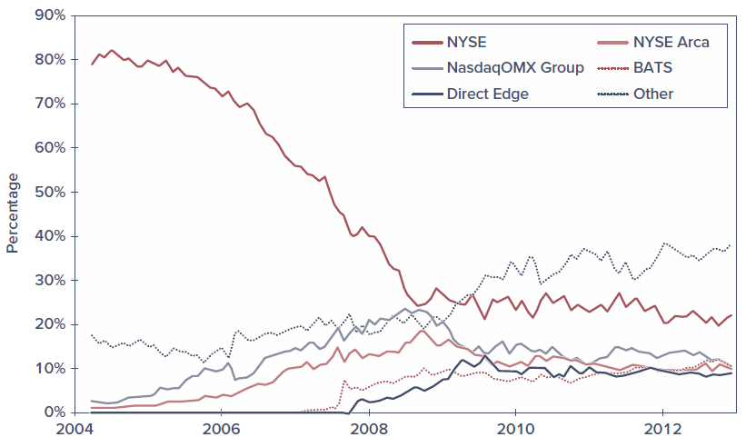
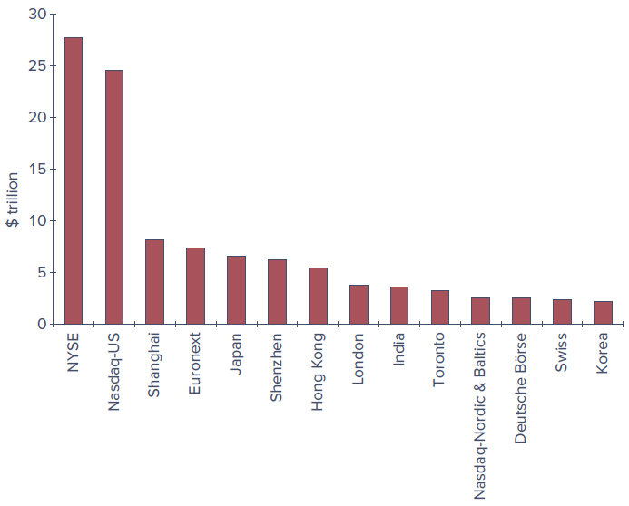

# Learning Objectives

By the end of this chapter, you should be able to:

- **LO 3-1** Describe how firms issue securities to the public.
- **LO 3-2** Identify various types of orders investors can submit to their brokers.
- **LO 3-3** Describe trading practices in dealer markets, formal stock exchanges, and electronic communication networks.
- **LO 3-4** Compare the mechanics and investment implications of buying on margin and short-selling.

## Chapter Roadmap {.unnumbered}

This chapter introduces the many venues and procedures available for trading securities. Trading mechanisms range from direct negotiation among market participants to fully automated computer crossing of trade orders.

The first time a security trades is when it is issued to the public, so we begin with how securities are initially marketed to the public by investment bankers. We then survey how already-issued securities are traded among investors, focusing on the differences between dealer markets, electronic markets, and formal stock exchanges. With that background, we look at specific arenas — the New York Stock Exchange, Nasdaq, and several all-electronic markets — and compare the mechanics of trade execution.

We then turn to the essentials of some specific transactions, such as **buying on margin** and **short-selling** stocks. We close with important aspects of the regulations governing security trading, including insider trading laws, circuit breakers, and the role of security markets as self-regulating organizations.

------------------------------------------------------------------------

# 3.1 How Firms Issue Securities

Firms regularly need to raise new capital to pay for their investment projects. Broadly speaking, they can raise funds either by borrowing or by selling shares in the firm. Investment bankers are generally hired to manage the sale of these securities in what is called a **primary market** for newly issued securities.

Once securities are issued, investors may wish to trade them among themselves. For example, selling some of your Apple shares to another investor has no impact on the total number of Apple shares outstanding. Trades in existing securities take place in the so-called **secondary market**.

Shares of *publicly listed* firms trade continually on well-known markets such as the New York Stock Exchange or the Nasdaq stock market; these are also called *publicly traded*, *publicly owned*, or just *public* companies. Other firms are *private corporations*, whose shares are held by small numbers of managers and investors and do not trade in public markets.

## 3.1.1 Privately Held Firms

A **privately held company** is owned by a relatively small number of shareholders. These firms have fewer obligations to release financial statements and other information to the public. This saves money and frees the firm from disclosing information that might be helpful to competitors. Eliminating quarterly earnings announcements can also give managers more flexibility to pursue long-term goals free of shareholder pressure.

When private firms wish to raise funds, they can sell shares directly to a small number of institutional or wealthy investors in a **private placement**. Rule 144A of the SEC allows these placements without the extensive and costly registration statements required of a public company. However, shares in privately held firms do not trade in secondary markets such as a stock exchange, which greatly reduces their **liquidity** — the ability to trade an asset at a fair price on short notice — and thus reduces the prices investors will pay for them. Investors demand price concessions to buy illiquid securities.

Until recently, privately held firms were allowed only up to 499 shareholders, which limited their ability to raise large amounts of capital. The **JOBS (Jumpstart Our Business Startups) Act of 2012** increased from 500 to 2,000 the number of shareholders a company may have before being required to register its common stock with the SEC and file public reports. It also loosened rules limiting how private firms could market shares to the public — for example, making it easier to engage in crowdfunding — and exempted smaller public companies (those with less than \$1 billion in annual gross revenues) from Section 404 of the Sarbanes–Oxley Act.

## 3.1.2 Publicly Traded Companies

When a private firm decides to raise capital from a wide range of investors, it may **go public** — selling its securities to the general public and allowing those investors to freely trade the shares. This first issue of shares to the general public is the firm's **initial public offering (IPO)**. Later, the firm may issue additional shares; a *seasoned equity offering* is the sale of additional shares in firms that already are publicly traded.

Public offerings of both stocks and bonds are typically marketed by investment bankers acting as **underwriters**. A lead firm forms an *underwriting syndicate* of other investment bankers to share responsibility for the issue. A preliminary registration statement must be filed with the Securities and Exchange Commission (SEC); when the statement is approved by the SEC, it is called the **prospectus**, and the offering price is announced.

In a typical underwriting arrangement, the investment bankers purchase the securities from the issuing company and resell them to the public. The issuing firm sells to the underwriting syndicate for the public offering price *less a spread* that compensates the underwriters. This is called a *firm commitment* because the underwriters bear the risk that they won't be able to sell the stock at the planned offering price.

{#fig-underwriting fig-alt="Flowchart from issuing firm to lead underwriter to four investment bankers to investors, grouped as an underwriting syndicate." width=70%}

## 3.1.3 Shelf Registration

In 1982, the SEC approved **Rule 415**, which allows firms that are already publicly traded to register securities and gradually sell them to the public for the next few years following the initial registration. Because the securities are already registered, they can be sold on short notice — even a 24-hour notice — with little additional paperwork, and in small amounts without incurring substantial flotation costs. The securities are "on the shelf," ready to be issued, which gives rise to the term *shelf registration*.

::: {.callout-note}
## Concept Check 3.1
Why does it make sense for shelf registration to be limited in time?
:::

## 3.1.4 Initial Public Offerings (IPO)

Once the SEC has commented on the registration statement and a preliminary prospectus has been distributed, investment bankers organize **road shows** to publicize the imminent offering. Road shows serve two purposes: they generate interest among potential investors, and they provide information to the issuing firm and its underwriters about the price at which the securities can be marketed. Large investors communicate their interest — these indications are called a *book*, and the process of polling potential investors is **bookbuilding**.

Because IPO shares are allocated in part based on the strength of each investor's expressed interest, investors have an incentive to reveal their optimism truthfully. In turn, the underwriter offers the security at a bargain price to induce participation in bookbuilding. As a result, IPOs are commonly **underpriced** relative to the price at which they could be marketed, reflected in the price jumps that occur when shares first trade publicly.

For example, Instacart's 2023 IPO issued about 22 million shares at \$30; the stock closed that day at \$33.70, about 12% above the offering price. While the explicit costs of an IPO tend to be around 7% of funds raised, underpricing is another cost — the money "left on the table." Not all IPOs are underpriced, however: Lyft's shares fell more than 40% below the offering price within two months, and Facebook's 2012 IPO fell about 15% below its \$38 offer price within a week. Despite typically attractive first-day returns (averaging over 18% between 1980 and 2020), IPOs have historically been poor long-term investments, underperforming the broad market over three-year holding periods.

An interesting but little-used alternative to a traditional IPO is a **direct listing**, in which a previously private company floats existing shares on the market but does *not* raise funds by issuing new shares. Notable direct listings include Spotify (2018), Slack (2019), ZipRecruiter (2021), and Coinbase (2021). Direct listings save the costs of an IPO but forgo after-market support such as underwriter-arranged *lock-up periods* that stabilize post-issuance prices.

::: {layout-ncol=2}
{fig-alt="Bar chart of average first-day IPO returns by European country, from Russia (~2%) to Greece (~50%)."}

{fig-alt="Bar chart of average first-day IPO returns by non-European country, from Argentina (~5%) to UAE (~180%)."}
:::

The results consistently indicate that, around the world, IPOs are marketed to investors at attractive prices.

## 3.1.5 SPACs versus Traditional IPOs

While IPOs are the conventional way to go public, 2021 was in large part the year of the **special purpose acquisition company (SPAC)**. The sponsor of a SPAC raises funds in its own IPO and goes public with *no underlying commercial operations*, then seeks to acquire a private company. If a suitable acquisition is not found within two years, the money must be returned to early investors. Because the ultimate acquisition is unknown when the SPAC raises funds, SPACs are often called *blank-check firms*, and the reputation of the sponsor is crucial.

The advantage is that an attractive target can be taken public much faster, with less information disclosure, and at lower cost than a traditional IPO. As an already publicly traded firm, a SPAC is also allowed to make more extensive business projections than would be permitted for a firm in a traditional IPO. Founders and early SPAC investors usually receive special compensation and the right to withdraw funds before a deal goes through, which limits their risk. Listings of new SPACs accounted for a bit more than half of the roughly \$300 billion raised in IPOs in 2021, but falling stock prices and rising interest rates in 2022 froze the market, and many SPACs were forced to liquidate. Regulators, particularly the SEC, have grown concerned about an uneven playing field for insiders versus regular investors.

------------------------------------------------------------------------

# 3.2 How Securities Are Traded

Financial markets develop to meet the needs of particular traders — bringing together buyers and sellers at low cost, providing adequate liquidity, minimizing the time to trade, promoting price continuity, updating asset prices, and reducing the information costs of investing. Without organized markets, any household wishing to invest would have to find others wishing to sell.

## 3.2.1 Types of Markets

We can differentiate four types of markets: direct search markets, brokered markets, dealer markets, and auction markets.

### 3.2.1.1 Direct Search Markets

A **direct search market** is the least organized market. Buyers and sellers must seek each other out directly — for example, selling used furniture by advertising on Craigslist or Facebook Marketplace. Such markets are characterized by sporadic participation and nonstandard goods, so it would not pay for most people or firms to specialize in them.

### 3.2.1.2 Brokered Markets

The next level of organization is a **brokered market**. Where trading in a good is active, brokers find it profitable to offer search services to buyers and sellers. A good example is the real estate market. The *primary market*, where new issues of securities are offered to the public, is another example of a brokered market: investment bankers act as brokers seeking investors to purchase securities directly from the issuing corporation.

### 3.2.1.3 Dealer Markets

When trading activity in a particular type of asset increases, **dealer markets** arise. Dealers specialize in various assets, purchase these assets for their own accounts, and later sell them for a profit from their inventory. The spreads between dealers' buy (bid) and sell (asked) prices are a source of profit. Dealer markets save traders on search costs. Most bonds and most foreign exchange trade in over-the-counter dealer markets.

### 3.2.1.4 Auction Markets

The most integrated market is an **auction market**, in which all traders converge at one place (physically or electronically) to buy or sell an asset. The New York Stock Exchange (NYSE) is an example. An advantage of auction markets over dealer markets is that one need not search across dealers to find the best price; if all participants converge, they can arrive at mutually agreeable prices and save the bid–ask spread.

Note that both over-the-counter dealer markets and stock exchanges are *secondary* markets, organized for investors to trade existing securities among themselves.

::: {.callout-note}
## Concept Check 3.2
Many assets trade in more than one type of market. What types of markets do the following trade in?

a. Used cars
b. Paintings
c. Rare coins
:::

## 3.2.2 Types of Orders

Broadly speaking, there are two types of orders: market orders and orders contingent on price.

### 3.2.2.1 Market Orders

**Market orders** are buy or sell orders to be executed immediately at current market prices. For example, a broker might report that the best **bid price** for Microsoft is \$230.79 and the best **ask price** is \$230.84, so the **bid–ask spread** is \$0.05. An order to buy 100 shares "at market" would be filled at \$230.84, and an order to "sell at market" at \$230.79.

This simple scenario has a few complications. Posted quotes are commitments to trade only up to a specified number of shares, so a large order may be filled at multiple prices. Figure 3.3 shows average *depth* (the total number of shares offered at the best bid and ask prices) over time; depth is considerably higher for large stocks than for smaller stocks, and depth is another component of liquidity. In addition, another trader may beat you to the quote, or the best quote may change before your order arrives.

::: {layout-ncol=2}
{fig-alt="Line chart of displayed market depth for the median stock, rising from about $40,000 in the mid-2000s to roughly $120,000 by 2013."}

{fig-alt="Line chart of displayed market depth for the largest stocks, rising from about $300,000 to roughly $1,000,000 with large swings."}
:::

### 3.2.2.2 Price-Contingent Orders

Investors may also place orders specifying the prices at which they are willing to trade. A **limit buy order** instructs the broker to buy shares if and when they can be obtained at or below a stipulated price. A **limit sell order** instructs the broker to sell if and when the price rises above a specified limit. A collection of limit orders waiting to be executed is called a *limit order book*. (A *stop order* is a related price-contingent order that is not to be executed until a specified price point is hit.)

**Figure 3.4** is a portion of the limit order book for Microsoft (ticker MSFT) taken from the CBOE electronic exchange on October 14, 2022. The best orders are at the top of the list — the highest buy price and the lowest sell price, called the *inside quotes*. Here the inside spread is only 5 cents, but order sizes at the inside quotes are fairly small, so investors interested in larger trades face an *effective* spread greater than the nominal one.

| Bid Price | Bid Shares | Ask Price | Ask Shares |
|:---------:|:----------:|:---------:|:----------:|
| 230.79 | 50  | 230.84 | 200 |
| 230.75 | 100 | 230.85 | 250 |
| 230.74 | 200 | 230.87 | 50  |
| 230.72 | 50  | 230.88 | 50  |
| 230.69 | 16  | 230.89 | 50  |

: Figure 3.4 — A portion of the limit order book for Microsoft on CBOE Global Markets, October 14, 2022. Source: markets.cboe.com. {tbl-colwidths="[25,25,25,25]"}

::: {.callout-note}
## Concept Check 3.3
What type of trading order might you give your broker in each of the following circumstances?

a. You want to buy shares of Intel to diversify your portfolio. You believe the share price is approximately at "fair" value, and you want the trade done quickly and cheaply.
b. You want to buy shares of Intel but believe the current stock price is too high. If shares could be obtained 5% lower than the current value, you would like to buy.
c. You believe your shares of FedEx may be priced generously and are thinking about selling, but a short-lived price increase of a few dollars would fully convince you they are overpriced and you would want to sell immediately.
:::

## 3.2.3 Trading Mechanisms

Broadly speaking, there are three trading systems employed in the United States: over-the-counter dealer markets, electronic communication networks, and specialist/designated market maker (DMM) markets. Electronic trading is by far the most prevalent.

### 3.2.3.1 Dealer Markets

Tens of thousands of securities trade on the **over-the-counter (OTC) market**. Thousands of brokers register with the SEC as security dealers who quote prices at which they are willing to buy or sell; a broker then executes a trade by contacting a dealer with an attractive quote. Before 1971, all OTC quotations were recorded manually and published daily on so-called *pink sheets*. In 1971, the National Association of Securities Dealers introduced its Automated Quotations System (Nasdaq) to link brokers and dealers in a computer network. While originally more of a price quotation system, what is now called the **Nasdaq Stock Market** allows automated electronic execution of trades at quoted prices, and the vast majority of trades are executed electronically.

### 3.2.3.2 Electronic Communication Networks (ECNs)

**Electronic communication networks (ECNs)** allow participants to post market and limit orders over computer networks, with the limit order book available to all participants. Orders that can be "crossed" — matched against another order — are executed automatically without requiring a broker's intervention. ECNs are therefore true trading systems, not merely price quotation systems.

ECNs register with the SEC as broker-dealers and are subject to *Regulation ATS* (for Alternative Trading System). Subscribers are typically institutional investors, broker-dealers, and market makers; individual investors must hire a broker who participates in the ECN. ECNs offer several advantages: trades are automatically crossed at a modest cost (typically less than a penny per share), execution is fast, and the systems offer considerable anonymity.

### 3.2.3.3 Specialist/DMM Markets

A **market maker** is a trader that quotes both a bid and an ask price to the public, providing liquidity so other traders can move into and out of positions quickly and cheaply. A **designated market maker (DMM)** is a market maker that accepts the obligation to commit its own capital to provide quotes and help maintain a "fair and orderly market." When the limit order book is thin and the spread becomes too wide, the DMM is expected to post narrower bid and ask prices from its own inventory, and to support the "weak" side of the market when buy and sell orders are imbalanced.

DMMs replaced what were formerly called *specialist* firms at the NYSE. Unlike the specialists they replaced, DMMs are not given advanced looks at the trading orders of other participants. While most NYSE trading is electronic, the exchange touts the DMM system as offering human intervention to maintain a smooth-functioning market during periods of stress and high volatility — most valuable at market open and close.

------------------------------------------------------------------------

# 3.3 The Rise of Electronic Trading

When first established, Nasdaq was primarily an over-the-counter dealer market and the NYSE was a specialist market, but today both are primarily electronic. These changes were driven by an interaction of new technologies and new regulations that allowed brokers to compete for business, broke the hold dealers once had on best-price information, forced integration of markets, and allowed securities to trade in ever-smaller price increments (called *tick sizes*). The resulting competition drove the cost of trade execution to a tiny fraction of its value just a few decades ago. A timeline of the major changes:

- **1969** — Instinet, the first ECN, is established.
- **1975** — Fixed commissions on the NYSE are eliminated; Congress amends the Securities Exchange Act to create the National Market System (NMS) to partially centralize trading.
- **1994** — A scandal reveals Nasdaq dealers colluding to maintain wide bid–ask spreads (better quotes were not made available to the public). In response, the SEC institutes new order-handling rules requiring published dealer quotes to reflect customers' limit orders, Nasdaq integrates ECN quotes into its display, and the SEC adopts Regulation ATS, letting ECNs register as stock exchanges. Bid–ask spreads narrow.
- **1997** — The SEC allows the minimum tick size to fall from one-eighth to one-sixteenth of a dollar.
- **2000** — The National Association of Securities Dealers (NASD) spins off the Nasdaq Stock Market as a separate entity, which evolves into a centralized limit-order matching system.
- **2001** — "Decimalization" allows the tick size to fall to 1 cent; bid–ask spreads fall dramatically again.
- **2006** — The NYSE acquires the electronic Archipelago Exchange and renames it NYSE Arca.
- **2005/2007** — The SEC adopts Regulation NMS (implemented 2007), requiring exchanges to honor quotes of other exchanges when they can be executed automatically. An exchange that could not handle a quote electronically would be labeled a "slow market" and could be ignored.

**Figure 3.5** shows estimates of the "effective spread" (the cost of a transaction) during three periods defined by the minimum tick size. Effective spread falls dramatically along with the minimum tick size. By 2015, quoted bid–ask spreads on large stocks were typically only 1 cent, and the median spread across all stocks was about 5 cents.

{#fig-spread fig-alt="Line chart of effective spread from 1993 to 2003, falling across the eighths, sixteenths, and decimal regimes." width=80%}

In the wake of Reg NMS, the NYSE lost its effective monopoly in trading its own listed stocks, and its share in the trading of NYSE-listed stocks fell from about 75% to 20% by the end of the decade. Trading today is overwhelmingly electronic, at least for stocks; bonds are still traded primarily in more traditional dealer markets.

------------------------------------------------------------------------

# 3.4 U.S. Markets

The NYSE and the Nasdaq Stock Market remain the best-known U.S. stock markets, but ECNs have steadily increased their market share. **Figure 3.6** shows the comparative trading volume of NYSE-listed shares on the NYSE and Nasdaq as well as the major ECNs (BATS, NYSE Arca, and Direct Edge). Since the underlying study was published, BATS and Direct Edge merged to create BATS Global Markets, which was in turn acquired by the CBOE. The "Other" category — now about 40% — includes so-called *dark pools* and *internalization* of order flow by brokerage firms.

{#fig-share fig-alt="Line chart showing the NYSE's share of trading in its own listed shares falling from about 80% in 2004 to about 22% in 2012, as ECNs and 'Other' venues rise." width=80%}

## 3.4.1 Nasdaq

The Nasdaq Stock Market lists around 3,300 firms and has steadily introduced ever-more-sophisticated trading platforms; the current version, the *Nasdaq Market Center*, consolidates Nasdaq's previous electronic markets into one integrated system. In 2007, Nasdaq merged with OMX (a Swedish-Finnish company controlling seven Nordic and Baltic exchanges) to form Nasdaq OMX Group.

Nasdaq has three levels of subscribers:

- **Level 3 subscribers** are registered market makers — the highest level. They make a market in securities, maintain inventories, and post bid and ask prices at which they commit to trade. They can enter and change quotes continually, have the fastest execution, and profit from the bid–ask spread.
- **Level 2 subscribers** receive all bid and ask quotes but cannot enter their own quotes. They can see which market makers offer the best prices; these tend to be brokerage firms that execute trades for clients but do not deal for their own account.
- **Level 1 subscribers** receive only inside quotes (the best bid and ask) but do not see how many shares are offered; these tend to be investors who want information on current prices.

## 3.4.2 The New York Stock Exchange

The NYSE is the largest U.S. **stock exchange** as measured by the market value of listed firms, and daily trading volume commonly exceeds 4 billion shares. In 2006 the NYSE merged with the Archipelago Exchange to form the NYSE Group, then merged with Euronext in 2007 to form NYSE Euronext; it acquired the American Stock Exchange in 2008 (renamed NYSE Amex). In 2013, NYSE Euronext was acquired by Intercontinental Exchange (ICE), whose main business had been energy-futures trading.

The NYSE was long committed to its specialist trading system, but it transitioned to electronic trading beginning in 1976 with its DOT (Designated Order Turnaround) and later SuperDOT systems, then Direct+ (2000), and the NYSE Hybrid Market (2006), which allowed brokers to send orders either for immediate electronic execution or to the specialist for possible price improvement. The Hybrid system let the NYSE qualify as a *fast market* under Reg NMS while still offering human intervention for more complicated trades. By contrast, NYSE Arca is fully electronic.

## 3.4.3 ECNs

Over time, more fully automated markets have gained market share at the expense of less automated ones, particularly the NYSE. Brokers affiliated with an ECN can enter orders in the limit order book; as orders are received, the system determines whether there is a matching order and, if so, immediately crosses the trade. Following Reg NMS, ECNs began listing limit orders on other networks, and traders could sift through the limit order books of many ECNs and route orders to the market with the best prices. These cross-market links became the impetus for high-frequency trading strategies that profit from small, transitory price discrepancies across markets.

**Latency** refers to the time it takes to accept, process, and deliver a trading order. CBOE Global Markets, which acquired the BATS platform, advertises average latency times of about 100 microseconds (0.0001 second).

------------------------------------------------------------------------

# 3.5 New Trading Strategies

The marriage of electronic trading mechanisms with computer technology has had far-ranging impacts on trading strategies and tools.

## 3.5.1 Algorithmic Trading

**Algorithmic trading** is the use of computer programs to make trading decisions. Well over half of all equity volume in the United States is believed to be initiated by computer algorithms. Many of these trades exploit very small discrepancies in security prices and entail numerous, rapid cross-market price comparisons that would not have been feasible before decimalization of the minimum tick size. Some algorithmic trades exploit very-short-term trends; others use *pairs trading*, in which normal price relations between pairs (or groups) of stocks are temporarily disrupted; still others exploit discrepancies between stock prices and stock-index futures. Some algorithmic trading resembles traditional market making — buying at the bid and selling at the ask — but these traders are not registered market makers and have no obligation to maintain quotes, so if they abandon the market during turbulence, the shock to liquidity can be disruptive.

::: {.callout-important}
## On the Market Front — The Flash Crash of 2010
At 2:42 p.m. New York time on May 6, 2010, the Dow Jones Industrial Average — already down about 300 points amid concerns about the European debt crisis — dropped an *additional* 600 points in the next five minutes, then recovered most of that within 20 minutes. Individual securities were even more disrupted: the iShares Russell 1000 Value Fund temporarily fell from \$59 to 8 cents, and Accenture traded at 1 cent, while price quotes for Apple and Hewlett-Packard momentarily rose above \$100,000. An SEC report pointed to a \$4 billion sale of index futures by a mutual fund; as prices tumbled, many algorithmic programs withdrew from the market, and liquidity evaporated. The SEC has since experimented with **circuit breakers**: for example, a 7% decline in the S&P 500 (before 3:25 p.m.) halts trading for 15 minutes, and a 20% decline halts trading for the remainder of the day. A *limit-up, limit-down* rule prevents individual stocks from trading outside time-varying price bands.
:::

## 3.5.2 High-Frequency Trading

**High-frequency trading** is a subset of algorithmic trading that relies on computer programs to make extremely rapid decisions, competing for trades that offer very small profits which, if numerous enough, accumulate to big money. One strategy is a form of market making; another relies on cross-market arbitrage, buying at one price and simultaneously selling at a slightly higher price, with the advantage going to firms quickest to identify and execute. Some strategies combine artificial intelligence with high-speed trading, using natural language processing on electronic news feeds to trade on announcements faster than any human could.

Because execution times are measured in milliseconds and even microseconds, trading firms "co-locate" their trading centers next to the exchanges' computer systems. As a calculation of why co-location matters: even light travels only 186 miles in one millisecond, so an order originating in Chicago would take almost five milliseconds to reach New York and could not compete with one launched from a co-located facility. This is a new version of an old phenomenon — brokerage firms once located their headquarters in New York to be near the NYSE.

## 3.5.3 Dark Pools

Many large traders seek anonymity, fearing that if others see them executing a large program, prices will move against them. Very large trades — called **blocks**, usually defined as more than 10,000 shares — were traditionally brought to "block houses" specializing in matching block buyers and sellers.

Block trading today has largely been displaced by **dark pools**, trading systems in which participants can buy or sell large blocks without showing their hand. Limit orders are not visible to the general public, traders' identities can be kept private, and trades are not reported until after they are crossed. Many dark pools simply match buyers and sellers at the midpoint of the bid and ask reported on other markets. Because these orders never appear in the consolidated limit order book (which displays the *national best bid and offer*, or NBBO), they do not contribute to *price discovery*, and dark pools have been criticized for exacerbating market fragmentation. Concerns also linger about whether dark pools truly exclude better-informed traders such as high-frequency traders, as illustrated by accusations against Pipeline LLC (2011) and Barclays (2014).

## 3.5.4 Internalization

**Order internalization** is a second major drain of trades away from exchanges: brokers match buy and sell orders internally rather than bringing them to exchanges. By doing so, the brokerage captures the bid–ask spread for itself and avoids paying exchange access fees charged under *maker/taker pricing* (market orders that "take" liquidity pay an access fee of about 0.3 cent per share, while limit orders that "make" liquidity receive a rebate of about 0.2 cent per share, with the exchange keeping about 0.1 cent). Together with dark pools, off-exchange trading now accounts for about 40% of trades, raising concerns that market fragmentation means prices may not reflect the full picture of supply and demand.

## 3.5.5 Bond Trading

In 2006, the NYSE expanded its bond trading system to include the debt issues of any NYSE-listed firm and expanded its electronic bond-trading platform. Nevertheless, the vast majority of bond trading occurs in the OTC market among bond dealers linked by a computer quotation system, even for bonds listed on the NYSE. New electronic platforms (for example, MarketAxess) now connect buyers and sellers directly but have not yet displaced the traditional dealer market. A key impediment is lack of standardization: a single company may have dozens of different bond issues differing by coupon, maturity, and seniority, and any one may trade only a few times a year. As a result, the corporate bond market is often quite "thin," subject to a type of liquidity risk, since it can be difficult to sell one's holdings quickly.

------------------------------------------------------------------------

# 3.6 Globalization of Stock Markets

**Figure 3.7** shows the market capitalization of firms listed on major stock exchanges around the world. By this measure, NYSE Euronext is by far the largest equity market. All major stock markets today are effectively electronic.

{#fig-worldcap fig-alt="Bar chart of world stock exchange market capitalization, led by NYSE (~$27.5T) and Nasdaq-US (~$24T)." width=80%}

Securities markets have come under increasing pressure to make international alliances or mergers, much of it due to electronic trading. As traders increasingly view stock markets as networks linking them to other traders, it becomes more important for exchanges to provide the cheapest and most efficient mechanism for executing and clearing trades. This argues for global alliances that facilitate cross-border trading, benefit from economies of scale, and eventually offer 24-hour global markets. The result has been a broad trend toward market consolidation, leaving a few giant exchanges: ICE (operating NYSE Euronext), Nasdaq, the LSE (London Stock Exchange Group), Deutsche Börse, the CME Group, the TSE (Tokyo Stock Exchange), and HKEX (Hong Kong Stock Exchange).

------------------------------------------------------------------------

# 3.7 Trading Costs

Part of the cost of trading a security is obvious and explicit: a broker's **commission**. Individuals can choose between two kinds of brokers. **Full-service brokers** provide a variety of services — executing orders, holding securities for safekeeping, extending margin loans, facilitating short sales, and offering research, analyses, and specific buy/sell recommendations. Some customers establish a *discretionary account*, allowing the broker to make buy and sell decisions; this requires trust, since an unscrupulous broker could *churn* an account (trade excessively to generate commissions). **Discount brokers** provide "no-frills" services — buying and selling securities, holding them, offering margin loans, and facilitating short sales — with price quotations as their main information service.

Stock trading fees have fallen dramatically; several firms (Charles Schwab, E\*Trade, Fidelity, Vanguard) have reduced trading commissions to zero. Online brokers instead earn income largely from interest on customer funds and from **payment for order flow** — passing customers' orders to high-frequency traders willing to pay for the opportunity to profit from the bid–ask spread. This practice is controversial because it may present a conflict of interest, though firms note that SEC rules prohibit executing trades at prices worse than the national best bid or offer.

Beyond the explicit commission, there is an implicit cost — the dealer's **bid–ask spread**, which ranges from a cent or so for the largest stocks to about 5 cents for average-sized stocks to considerably more for small stocks. Dealers who post quotes face an *adverse selection* problem: if their posted prices are wrong, they attract the most trading interest exactly when it hurts them, since they have effectively issued a free option to better-informed traders. Dealers therefore trade off the spread's profit against the expected loss from dealing with more sophisticated traders. This explains why well-known stocks, for which information is abundant, have lower spreads, while smaller, lesser-known, and less-researched stocks have higher spreads. A further implicit cost is the price concession an investor may make for trading in quantities greater than those associated with the posted bid or ask.

------------------------------------------------------------------------

# 3.8 Buying on Margin

When purchasing securities, investors have easy access to debt financing called *broker's call loans*; taking advantage of these loans is called **buying on margin**. Purchasing on margin means the investor borrows part of the purchase price from the broker. The **margin** in the account is the portion of the purchase price contributed by the investor. Brokers borrow from banks at the *call money rate* to finance these purchases, then charge clients that rate plus a service charge. All securities purchased on margin must be maintained with the brokerage firm in *street name*, as collateral for the loan.

The Federal Reserve's Board of Governors limits margin borrowing. The **initial margin requirement (Regulation T)** is 50%, meaning at least 50% of the purchase price must be paid in cash, with the rest borrowed. Equivalently, $1 - \text{IMR}$ is the maximum percent the investor can borrow.

::: {.callout-tip}
## Example 3.1 — Margin
The *percentage margin* is the ratio of the net worth (or "equity value") of the account to the market value of the securities. Suppose an investor pays \$6,000 toward \$10,000 worth of stock (100 shares at \$100), borrowing the remaining \$4,000. The initial balance sheet is:

| Assets |  | Liabilities and Owners' Equity |  |
|:-------|-----:|:------------------|-----:|
| Value of stock | \$10,000 | Loan from broker | \$4,000 |
|  |  | Equity | \$6,000 |

$$\text{Margin} = \frac{\text{Equity in account}}{\text{Value of stock}} = \frac{\$6{,}000}{\$10{,}000} = 0.60,\ \text{or } 60\%$$

If the price declines to \$70 per share, the balance sheet becomes:

| Assets |  | Liabilities and Owners' Equity |  |
|:-------|-----:|:------------------|-----:|
| Value of stock | \$7,000 | Loan from broker | \$4,000 |
|  |  | Equity | \$3,000 |

The assets fall by the full decrease in stock value, as does the equity:

$$\text{Margin} = \frac{\$3{,}000}{\$7{,}000} = 0.43,\ \text{or } 43\%$$
:::

If the stock value fell below \$4,000, owners' equity would become negative — the stock would no longer provide sufficient collateral. To guard against this, the broker sets a **maintenance margin**. If the percentage margin falls below the maintenance level, the broker issues a **margin call** requiring the investor to add cash or securities. If the investor does not act, the broker may sell securities from the account to restore the margin.

::: {.callout-tip}
## Example 3.2 — Maintenance Margin
Suppose the maintenance margin is 30%. How far could the stock price fall before a margin call? Let $P$ be the price. The value of 100 shares is $100P$, and the equity is $100P - \$4{,}000$. Setting the percentage margin equal to 0.30:

$$\frac{100P - 4{,}000}{100P} = 0.30$$

which implies $P = \$57.14$. If the price falls below \$57.14 per share, the investor receives a margin call.
:::

::: {.callout-note}
## Concept Check 3.4
Suppose the maintenance margin in Example 3.2 is 40%. How far can the stock price fall before the investor gets a margin call?
:::

**Why buy on margin?** Investors buy on margin when they wish to invest more than their own money allows, achieving greater upside potential but also greater downside risk. Suppose an investor is bullish on Fincorp stock at \$100 per share. With \$10,000 to invest and an expected 30% price increase, buying 100 shares outright yields a 30% return. But if the investor borrows another \$10,000 at a 9% margin loan rate and buys 200 shares (\$20,000):

- If the stock rises 30%, the 200 shares are worth \$26,000. After repaying \$10,900 of principal and interest, \$15,100 remains, a return of $(\$15{,}100 - \$10{,}000)/\$10{,}000 = 51\%$.
- If the stock *falls* 30%, the 200 shares are worth \$14,000, leaving \$3,100 after the \$10,900 repayment, a return of $(\$3{,}100 - \$10{,}000)/\$10{,}000 = -69\%$.

Table 3.1 summarizes these results. If there is no change in the stock price, the investor loses 9%, the cost of the loan.

| Change in Stock Price | End-of-Year Value of Shares | Repayment of Principal and Interest\* | Investor's Rate of Return |
|:---------------------|:----:|:----:|:----:|
| 30% increase | \$26,000 | \$10,900 | 51% |
| No change    | 20,000 | 10,900 | −9% |
| 30% decrease | 14,000 | 10,900 | −69% |

: Table 3.1 — Illustration of buying stock on margin. \*Assuming the investor buys \$20,000 of stock by borrowing \$10,000 at 9% per year. A negative cash flow implies a cash outflow. {tbl-colwidths="[30,24,24,22]"}

::: {.callout-note}
## Concept Check 3.5
Suppose that in the Fincorp example the investor borrows only \$5,000 at the same 9% interest rate. What will the rate of return be if the stock price increases by 30%? If it falls by 30%? If it remains unchanged?
:::

------------------------------------------------------------------------

# 3.9 Short Sales

An investor who is bullish on a firm buys shares and later sells them, hopefully at a higher price. A bearish investor who wants to bet against a company can enter a **short sale**, which profits from a *decline* in a security's price. In a short sale, you *first sell and then buy* the shares: the short-seller borrows a share from a broker and sells it, then later purchases a share to replace the one borrowed — called *covering the short position*.

The short-seller anticipates the price will fall so the share can be bought back at a lower price. Short-sellers must not only replace the shares but also pay the lender any dividends paid during the short sale. In practice, the loaned shares are provided by the short-seller's brokerage firm, which holds securities of its other investors in street name. If the brokerage cannot locate new shares to replace those sold, the short-seller must repay the loan immediately by buying shares in the market. Exchange rules require that proceeds from a short sale be kept on account with the broker, and short-sellers must post **margin** (cash or collateral) to cover potential losses should the price rise. (The initial margin for a short sale is usually 50%, more for low-priced stocks. The SEC eliminated the "uptick rule" in July 2007.)

| Time | Action | Cash Flow\* |
|:----:|:-------|:-----------:|
| 0 | Buy share | −Initial price |
| 1 | Receive dividend, sell share | Ending price + Dividend |

: Table 3.2, Panel A — Purchase of stock. Profit = (Ending price + Dividend) − Initial price. {tbl-colwidths="[12,58,30]"}

| Time | Action | Cash Flow\* |
|:----:|:-------|:-----------:|
| 0 | Borrow share; sell it | +Initial price |
| 1 | Repay dividend and buy share to replace the one borrowed | −(Ending price + Dividend) |

: Table 3.2, Panel B — Short sale of stock. Profit = Initial price − (Ending price + Dividend). \*A negative cash flow implies a cash outflow. {tbl-colwidths="[12,58,30]"}

::: {.callout-important}
## On the Market Front — The GameStop Short Squeeze
In late 2020, GameStop was a struggling company whose stock was being shorted by several hedge funds. When the former CEO of Chewy joined the board, its prospects seemed to brighten, and it became a "meme stock" on the r/WallStreetBets subreddit and among traders on Robinhood. The price rose from about \$17 at the start of January 2021 to an intraday high of \$438 on January 28. As the price rose, more than 100% of the public float had been sold short, and losses on short positions soared until a *short squeeze* occurred — there were not enough shares available to satisfy all the shorts wanting to liquidate. Losses to short sellers were reportedly around \$6 billion. When the clearinghouse required Robinhood to post additional collateral, the brokerage halted trading of several companies, and by February 2 the stock had fallen below \$100.
:::

::: {.callout-tip}
## Example 3.3 — Short Sales
Suppose you are bearish on Dot Bomb stock at \$100 per share and short 1,000 shares. The \$100,000 cash proceeds are credited to your account. With a 50% margin requirement, you must have other cash or securities worth at least \$50,000. Suppose you have \$50,000 in Treasury bills:

| Assets |  | Liabilities and Owners' Equity |  |
|:-------|-----:|:------------------|-----:|
| Cash   | \$100,000 | Short position in Dot Bomb (1,000 shares owed) | \$100,000 |
| T-bills | 50,000 | Equity | 50,000 |

$$\text{Percentage margin} = \frac{\text{Equity}}{\text{Value of shares owed}} = \frac{\$50{,}000}{\$100{,}000} = 0.50$$

If Dot Bomb falls to \$70, you cover by buying 1,000 shares for \$70,000. Because your account was credited \$100,000 when the shares were sold, your profit is \$30,000 — the decline in share price times the number of shares sold short.
:::

Like investors who buy on margin, a short-seller must be concerned about margin calls: if the price *rises*, the margin in the account falls; if it reaches the maintenance level, the short-seller receives a margin call.

::: {.callout-tip}
## Example 3.4 — Margin Calls on Short Positions
Suppose the maintenance margin is 30%. Let $P$ be the price of Dot Bomb. The value of shares you must repay is $1{,}000P$, and the equity is $\$150{,}000 - 1{,}000P$. Setting the short-position margin ratio equal to 0.30:

$$\frac{150{,}000 - 1{,}000P}{1{,}000P} = 0.30$$

which implies $P = \$115.38$. If Dot Bomb rises above \$115.38 per share, you get a margin call and must either add cash or cover your short.
:::

::: {.callout-note}
## Concept Check 3.6
a. Construct the balance sheet if Dot Bomb goes up to \$110.
b. If the short-position maintenance margin in Example 3.4 is 40%, how far can the stock price rise before the investor gets a margin call?
:::

------------------------------------------------------------------------

# 3.10 Regulation of Securities Markets

Trading in U.S. securities markets is regulated by a myriad of laws. The major governing legislation is the **Securities Act of 1933** and the **Securities Exchange Act of 1934**. The 1933 act requires full disclosure of relevant information relating to the issue of new securities, including registration and issuance of a prospectus. SEC approval is *not* an endorsement of the security as a good investment; the SEC cares only that relevant facts are disclosed. The 1934 act established the Securities and Exchange Commission to administer the 1933 act and extended the disclosure principle by requiring periodic disclosure by firms with already-issued securities.

The 1934 act also empowers the SEC to register and regulate securities exchanges, OTC trading, brokers, and dealers. The SEC shares responsibility with other agencies: the **Commodity Futures Trading Commission (CFTC)** regulates futures markets, and the **Federal Reserve** has broad responsibility for the health of the financial system, setting margin requirements and regulating bank lending to market participants. The **Securities Investor Protection Act of 1970** established the Securities Investor Protection Corporation (SIPC) to protect investors from losses if their brokerage firms fail, up to \$500,000 per customer. Security trading is also subject to state laws — known as *blue sky laws* — many of which were unified through the Uniform Securities Act of 1956.

## 3.10.1 Self-Regulation

In addition to government regulation, there is considerable self-regulation of the securities market. The most important overseer is the **Financial Industry Regulatory Authority (FINRA)**, the largest nongovernmental regulator of securities firms in the United States, formed in 2007 through the consolidation of the NASD with the self-regulatory arm of the NYSE. FINRA examines securities firms, writes and enforces rules concerning trading practices, and administers a dispute resolution forum. There is also self-regulation within the community of investment professionals: for example, the **CFA Institute** has developed standards of professional conduct governing members with the Chartered Financial Analyst (CFA) designation, spanning professionalism, integrity of capital markets, duties to clients and employers, investment analysis and recommendations, conflicts of interest, and responsibilities as CFA Institute members.

## 3.10.2 Sarbanes-Oxley Act

The scandals of 2000–2002 centered on three broad practices: allocations of shares in IPOs, tainted securities research put out to the public, and — most importantly — misleading financial statements and accounting practices. The **Sarbanes-Oxley Act (SOX)**, passed by Congress in 2002, responded with several key provisions:

- It created the **Public Company Accounting Oversight Board** to oversee the auditing of public companies.
- It required independent financial experts to serve on the audit committees of a firm's board of directors.
- CEOs and CFOs must personally certify that their firms' financial reports fairly represent the operations and financial condition of the company, subject to personal penalties if misleading.
- Auditors may no longer provide several other services to their clients, to prevent consulting profits from influencing audit quality.
- The board of directors must be composed of independent directors and hold regular meetings without company management present.

More recently there has been push-back on SOX, with some observers arguing that compliance costs are too onerous, especially for smaller firms (the 2012 JOBS Act relieved many smaller firms of some obligations). A related contentious issue is *rules-based* regulation (specifying exactly what is or is not allowed — generally the U.S. approach) versus *principles-based* regulation (relying on a less explicitly defined set of understandings — the more popular model worldwide).

## 3.10.3 Insider Trading

Regulations also prohibit insider trading. It is illegal to transact in securities to profit from **inside information** — private information held by officers, directors, or major stockholders that has not yet been divulged to the public. The definition of insiders can be ambiguous: while a chief financial officer is clearly an insider, it is less clear whether a firm's biggest supplier — who may deduce the firm's prospects from changes in orders — should be considered one. These ambiguities plague security analysts, whose job is to uncover as much information as possible.

The SEC requires officers, directors, and major stockholders to report all transactions in their firm's stock and publishes a compendium of insider trades, informing the public of any implicit vote of confidence. Evidence that insiders do exploit their knowledge comes in three forms: well-publicized convictions in insider trading schemes; "leakage" of information before public announcements (for example, share prices of firms rising a few days *before* dividend-increase announcements); and studies of returns earned on insider trades — Jaffe (1974) found that when insider purchasers exceeded insider sellers by three or more, the stock outperformed its benchmark over the following eight months by about 5%.

------------------------------------------------------------------------

# Summary

- Firms issue securities to raise the capital necessary to finance their investments. Investment bankers market these securities to the public on the primary market, generally acting as underwriters who purchase the securities from the firm and resell them at a markup. Before the securities may be sold, the firm must publish an SEC-approved prospectus.
- Already-issued securities are traded on the secondary market — in organized stock markets or, primarily for bonds, on the over-the-counter market. Brokerage firms with access to exchanges charge commissions for executing trades.
- Trading may take place in dealer markets, via electronic communication networks, or in specialist/designated market maker markets. In dealer markets, security dealers post bid and ask prices at which they are willing to trade. In electronic markets, the existing book of limit orders provides the terms at which trades can be executed, and mutually agreeable offers are automatically crossed.
- Nasdaq was traditionally a dealer market and the NYSE was traditionally a specialist market. Today, the overwhelming majority of trades on both exchanges are electronic.
- Buying on margin means borrowing money from a broker to buy more securities than can be purchased with one's own money alone. This magnifies both upside potential and downside risk; if equity falls below the required maintenance level, the investor gets a margin call.
- Short-selling is the practice of selling securities the seller does not own. The short-seller borrows the securities from a broker, sells them, and may be required to cover the short position on demand. Proceeds are kept in escrow by the broker, and the broker usually requires the short-seller to post margin.
- Securities trading is regulated by the SEC, by other government agencies, and through self-regulation of the exchanges. Many important regulations concern full disclosure, and insider trading rules prohibit traders from profiting from inside information.

------------------------------------------------------------------------

# Key Terms

**primary market** — Market for new issues of securities.

**secondary market** — Markets in which previously issued securities are traded among investors.

**private placement** — Primary offerings in which shares are sold directly to a small group of institutional or wealthy investors.

**initial public offering (IPO)** — First public sale of stock by a formerly private company.

**underwriters** — Underwriters purchase securities from the issuing company and resell them to the public.

**prospectus** — A description of the firm and the security it is issuing.

**direct listing** — A previously private company floats existing shares on the stock market but does not raise funds by issuing new shares to the public.

**special purpose acquisition company (SPAC)** — A publicly listed company with cash but no current underlying business activity that seeks to acquire a private firm, thereby taking it public without engaging in a traditional IPO.

**dealer markets** — Markets in which traders specializing in particular assets buy and sell for their own accounts.

**auction market** — An exchange or electronic platform where all traders can convene to buy or sell an asset.

**bid price** — The price at which a dealer or other trader is willing to purchase a security.

**ask (or asked) price** — The price at which a dealer or other trader will sell a security.

**bid–ask spread** — The difference between the bid and asked prices.

**limit buy order** — An order specifying a price at which an investor is willing to buy a security.

**limit sell order** — An order specifying a price at which an investor is willing to sell a security.

**over-the-counter (OTC) market** — An informal network of brokers and dealers who negotiate sales of securities.

**Nasdaq Stock Market** — The computer-linked price quotation and trade execution system.

**electronic communication networks (ECNs)** — Computer networks that allow direct trading without the need for market makers.

**designated market maker** — A market maker designated by the exchange to commit its own capital to provide quotes and help maintain a "fair and orderly market" by trading from its own inventory of shares.

**stock exchanges** — Secondary markets where already-issued securities are bought and sold by members.

**latency** — The time it takes to accept, process, and deliver a trading order.

**algorithmic trading** — The use of computer programs to make rapid trading decisions.

**high-frequency trading** — A subset of algorithmic trading that relies on computer programs to make very rapid trading decisions.

**blocks** — Large transactions in which at least 10,000 shares of stock are bought or sold.

**dark pools** — Electronic trading networks where participants can anonymously buy or sell large blocks of securities.

**margin** — Describes securities purchased with money borrowed in part from a broker. The margin is the net worth of the investor's account.

**short sale** — The sale of shares not owned by the investor but borrowed through a broker and later purchased to replace the loan.

**inside information** — Nonpublic knowledge about a corporation possessed by corporate officers, major owners, or other individuals with privileged access to information about the firm.

------------------------------------------------------------------------

# Solutions to Concept Checks

**3.1** Limited-time shelf registration was introduced as a compromise between saving issue costs and providing disclosure. Allowing unlimited shelf registration would circumvent "blue sky" laws that ensure proper disclosure as the financial circumstances of the firm change over time.

**3.2**

a. Used cars trade in dealer markets (used-car lots or auto dealerships) and in direct search markets when individuals advertise on websites such as Craigslist.
b. Paintings trade in broker markets (clients commission brokers to buy or sell art), in dealer markets at art galleries, and in auction markets.
c. Rare coins trade in dealer markets (coin shops or shows), but also in auctions and in direct search markets when individuals advertise they want to buy or sell coins.

**3.3**

a. You should give your broker a market order. It will be executed immediately and is the cheapest type of order in terms of brokerage fees.
b. You should give your broker a limit order to buy, which will be executed only if the shares can be obtained at a price about 5% below the current price.
c. You should give your broker a limit-sell order, which will be executed if the share price rises above the level at which you are convinced the firm is overvalued.

**3.4** Solving

$$\frac{100P - \$4{,}000}{100P} = 0.4$$

implies $P = \$66.67$ per share.

**3.5** The investor will purchase 150 shares, with a rate of return as follows:

| Year-End Change in Price | Year-End Value of Shares | Repayment of Principal and Interest | Investor's Rate of Return |
|:---------------------|:----:|:----:|:----:|
| 30% | \$19,500 | \$5,450 | 40.5% |
| No change | 15,000 | 5,450 | −4.5% |
| −30% | 10,500 | 5,450 | −49.5% |

**3.6**

a. Once Dot Bomb stock increases to \$110, your balance sheet will be:

| Assets |  | Liabilities and Owners' Equity |  |
|:-------|-----:|:------------------|-----:|
| Cash | \$100,000 | Short position in Dot Bomb | \$110,000 |
| T-bills | 50,000 | Equity | 40,000 |

b. Solving

$$\frac{\$150{,}000 - 1{,}000P}{1{,}000P} = 0.4$$

implies $P = \$107.14$ per share.

------------------------------------------------------------------------

## Looking Ahead

**Chapter 4 — Mutual Funds and Other Investment Companies:** a closer look at investment companies and the pooled investment vehicles — mutual funds, ETFs, and others — through which many investors access the markets described in this chapter.

Please review Chapter 3, attempt the assigned problem sets, and bring questions to office hours.
