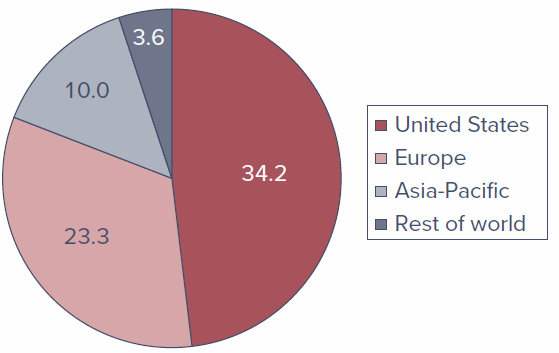

# Introduction

Chapter 3 introduced the mechanics of trading securities and the structure of the markets in which they trade. Very often, though, individual investors choose **not** to trade directly for their own accounts. Instead, they direct their money to **investment companies** that buy securities on their behalf. The most important of these financial intermediaries are **mutual funds** and **exchange-traded funds (ETFs)**, but there are several other investment vehicles worth knowing.

This chapter describes and compares the major types of investment companies, examines the investment styles and policies of mutual funds, looks closely at the costs of investing in them, and takes a first look at how mutual fund performance stacks up against a simple passive benchmark.

## Learning Objectives {.unnumbered}

- **LO 4-1** — Cite advantages and disadvantages of investing with an investment company rather than buying securities directly.
- **LO 4-2** — Contrast open-end mutual funds with closed-end funds, unit investment trusts, hedge funds, and exchange-traded funds.
- **LO 4-3** — Define *net asset value* and measure the rate of return on a mutual fund.
- **LO 4-4** — Classify mutual funds according to investment style.
- **LO 4-5** — Demonstrate the impact of expenses and turnover on mutual fund investment performance.

------------------------------------------------------------------------

## 4.1 Investment Companies

**Investment companies** are financial intermediaries that collect funds from individual investors and invest those funds in a potentially wide range of securities or other assets. **Pooling of assets is their defining feature.** Each investor holds a claim to the portfolio in proportion to the amount invested, which lets small investors "team up" to obtain the benefits of large-scale investing.

Investment companies perform several important functions for their investors:

1.  **Record keeping and administration.** Funds issue periodic status reports and keep track of capital gains distributions, dividends, investments, and redemptions. They may also reinvest dividend and interest income for shareholders.
2.  **Diversification and divisibility.** By pooling money, funds let investors hold fractional shares of many different securities and act as large investors even when no single shareholder could.
3.  **Professional management.** Funds can support full-time staffs of security analysts and portfolio managers who seek superior results.
4.  **Lower transaction costs.** Because they trade in large blocks, funds achieve substantial savings on trading costs.

### Net Asset Value

While all investment companies pool investor assets, they also need a way to divide claims to those assets. Ownership is proportional to the number of shares purchased, and the value of each share is called **net asset value (NAV)**.

$$
\text{Net asset value} = \frac{\text{Market value of assets} - \text{Liabilities}}{\text{Shares outstanding}}
$$

**Worked example.** Consider a fund managing a portfolio of securities worth \$120 million. Suppose it owes \$4 million to its investment advisers and another \$1 million for rent, wages, and miscellaneous expenses, and has 5 million shares outstanding:

$$
\text{NAV} = \frac{\$120\text{ million} - \$5\text{ million}}{5\text{ million shares}} = \$23 \text{ per share}
$$

::: {.callout-tip}
## Concept Check 4.1
Using data from Fidelity's Focused Stock Fund (all values in millions) — Assets \$4,034.4, Liabilities \$81.7, Shares 101.11 — what was the net asset value of the portfolio?

*Solution:* NAV = (\$4,034.4 − \$81.7) / 101.11 = **\$39.09 per share**.
:::

------------------------------------------------------------------------

## 4.2 Types of Investment Companies

In the United States, investment companies are classified by the **Investment Company Act of 1940** as either **unit investment trusts** or **managed investment companies**. The portfolios of unit investment trusts are essentially fixed, and so they are called "unmanaged." In managed companies, securities are continually bought and sold — the portfolios are *managed*. Managed companies are further classified as either **closed-end** or **open-end**. Open-end companies are what we commonly call **mutual funds**.

### 4.2.1 Unit Investment Trusts

**Unit investment trusts** are pools of money invested in a portfolio that is fixed for the life of the fund. To form one, a sponsor (typically a brokerage firm) buys a portfolio of securities, deposits them into a trust, and sells shares — or "units," called *redeemable trust certificates* — to the public. All income and principal payments from the portfolio are passed through by the fund's trustees (a bank or trust company) to the shareholders.

Key characteristics:

- **Unmanaged.** Once established, the portfolio composition is fixed, so trusts tend to invest in relatively uniform types of assets (for example, one trust in municipal bonds, another in corporate bonds). Because the portfolio is so stable, management fees can be lower than those of managed funds.
- **Sold at a premium.** Sponsors profit by selling units at a premium to the cost of the underlying assets. For example, a trust holding \$5 million of assets might sell 5,000 units at \$1,030 each — a 3% premium representing the trustee's fee for establishing the trust.
- **Liquidation before termination.** Investors who wish to exit early can sell units back to the trustee for net asset value; the trustee either sells enough of the portfolio to raise cash or resells the units to a new investor.

Unit investment trusts have steadily lost market share to mutual funds. Even as mutual fund assets soared, assets in such trusts declined from \$105 billion in 1990 to only \$95 billion in 2022.

### 4.2.2 Managed Investment Companies

There are two types of managed companies: **closed-end** and **open-end**. In both cases the fund's board of directors, elected by shareholders, hires a management company to run the portfolio for an annual fee that typically ranges from **0.2% to 1.5% of assets**. Often the management company is the firm that organized the fund (for example, Fidelity Management and Research Corporation sponsors and manages many Fidelity funds); in other cases a fund hires an outside adviser (for example, Vanguard hired Wellington Management for its Wellington Fund). Most management companies run several funds.

#### 4.2.2.1 Closed-End Funds

**Closed-end funds** do not redeem or issue shares. Investors who want to cash out must sell their shares to other investors. Shares trade on organized exchanges and can be bought through brokers like any other common stock, so **their prices can differ from NAV**.

For closed-end funds, the premium or discount is the percentage difference between price and NAV:

$$
\text{Premium (or Discount)} = \frac{\text{Price} - \text{NAV}}{\text{NAV}}
$$

**Discounts to NAV** (negative differences) are more common than premiums; in 2021 the average discount on closed-end funds was 5.2%. This divergence of price from NAV, often by wide margins, is a puzzle that has never been fully explained: an investor could in principle liquidate a fund selling below NAV and immediately capture the difference, yet sizable discounts persist for long periods. Adding to the puzzle, closed-end funds are frequently issued *above* NAV even though they tend to fall to a discount shortly after issue. Research (Pontiff, 1995) suggests that because premiums and discounts tend to dissipate over time, a fund selling at a 20% discount had an expected 12-month return more than 6% greater than funds selling at NAV.

#### 4.2.2.2 Open-End Funds

**Open-end funds** stand ready to redeem or issue shares at their net asset value (though purchases and redemptions may involve sales charges). When investors want to cash out, they sell shares back to the fund at NAV rather than to another investor.

Key points:

- Prices of open-end funds **never fall below NAV**, because the fund stands ready to redeem at NAV. The offering price will *exceed* NAV, however, if the fund carries a **load** (a sales charge).
- Open-end funds do **not** trade on organized exchanges; investors buy from and liquidate through the investment company directly. As a result, the number of outstanding shares changes daily.

### 4.2.3 Exchange-Traded Funds

**Exchange-traded funds (ETFs)** are similar in many respects to mutual funds. Like mutual funds, most ETFs are classified and regulated as investment companies, offer a pro-rated ownership share of a portfolio of stocks, bonds, or other assets, and must report net asset value each day.

The key difference: rather than buying and redeeming shares directly with the sponsoring company, investors **buy and sell ETF shares through a broker just as they would shares of stock.** These transactions occur continuously throughout the day, rather than once a day at the NAV computed at market close.

ETFs were first offered in the United States in 1993 and, until about 2008, tracked market indexes exclusively. They have grown tremendously: by early 2022, about 2,690 ETFs held roughly \$7.2 trillion in assets in the United States. *(ETFs are discussed in more detail in Section 4.6.)*

### 4.2.4 Other Investment Organizations

Some intermediaries are not formally organized or regulated as investment companies but nevertheless serve similar functions. The most important are commingled funds, real estate investment trusts, and hedge funds.

#### 4.2.4.1 Commingled Funds

**Commingled funds** are partnerships of investors that pool their funds. The management firm that organizes the partnership — for example, a bank or insurance company — manages the funds for a fee. Typical partners are trust or retirement accounts with portfolios larger than most individuals' but still too small to manage separately.

Commingled funds resemble open-end mutual funds, but instead of shares the fund offers **units**, which are bought and sold at net asset value. A bank or insurer may offer an array of commingled funds — for example, a money market fund, a bond fund, and a common stock fund.

#### 4.2.4.2 Real Estate Investment Trusts (REITs)

A **REIT** is similar to a closed-end fund. REITs invest in real estate or in loans secured by real estate. Besides issuing shares, they raise capital by borrowing from banks and issuing bonds or mortgages, and most are highly leveraged, with a typical debt ratio of about 70%.

Two principal kinds:

- **Equity trusts** invest in real estate directly.
- **Mortgage trusts** invest primarily in mortgage and construction loans.

REITs are generally established by banks, insurance companies, or mortgage companies, which then serve as investment managers to earn a fee.

#### 4.2.4.3 Hedge Funds

Like mutual funds, **hedge funds** are vehicles that allow investors to pool assets to be invested by a fund manager. Unlike mutual funds, however, hedge funds are commonly structured as **private partnerships** and are therefore not subject to many SEC regulations. Distinguishing features:

- Typically open only to **wealthy or institutional investors**.
- Many require initial **"lock-ups"** — periods (sometimes several years) during which investments cannot be withdrawn. Lock-ups let hedge funds hold illiquid assets without worrying about redemptions.
- Because they are only lightly regulated, managers can pursue strategies not open to mutual fund managers — heavy use of **derivatives, short sales, and leverage**, plus strategies focused on distressed firms, currency speculation, convertible bonds, emerging markets, merger arbitrage, and more.

Hedge funds grew dramatically in recent decades, with assets under management ballooning from about \$50 billion in 1990 to \$5 trillion in 2023.

------------------------------------------------------------------------

## 4.3 Mutual Funds

Assets under management in the U.S. mutual fund industry were about **\$27 trillion** in early 2022, while about **\$7.2 trillion** was held in ETFs. Roughly another \$37 trillion was invested in funds of non-U.S. sponsors.

Management companies manage a family, or "complex," of mutual funds — organizing an entire collection of funds and collecting a fee for operating them. This makes it easy for investors to allocate across market sectors and switch across funds while benefiting from centralized record keeping. Well-known complexes include **Fidelity, Vanguard, and BlackRock**. In 2022 there were about 8,900 mutual funds in the United States, offered by about 825 fund complexes.

### 4.3.1 Investment Policies

Each mutual fund has a specified **investment policy**, described in its prospectus. Money market funds hold short-term, low-risk instruments; bond funds hold fixed-income securities; and some funds have even more narrowly defined mandates. The major fund types, classified by investment policy, follow.

#### 4.3.1.1 Money Market Funds

These funds invest in money market securities such as **Treasury bills, commercial paper, repurchase agreements, or certificates of deposit**. The average maturity tends to be a bit more than one month. They usually offer check-writing features, and net asset value is fixed at \$1 per share, so there are no tax implications on redemption.

Money market funds are classified as **prime** versus **government**:

- **Government funds** hold short-term U.S. Treasury or agency securities and repurchase agreements collateralized by such securities.
- **Prime funds** also hold other instruments such as commercial paper or bank CDs — very safe, but riskier than government securities and more prone to reduced liquidity in times of market stress.

Since the 2008 financial crisis there has been a large shift in demand from prime to government funds. In addition, while retail prime and government funds maintain a \$1.00 NAV, **prime institutional funds now must calculate (i.e., "float") their NAV**, which further contributed to the shift toward government funds.

#### 4.3.1.2 Equity Funds

**Equity funds** invest primarily in stock, though managers may also hold fixed-income or other securities at their discretion. They commonly hold a small fraction of assets in money market securities to provide liquidity for redemptions.

Traditionally, stock funds are classified by their emphasis on capital appreciation versus current income:

- **Income funds** hold shares of firms with high dividend yields that provide high current income.
- **Growth funds** forgo current income, focusing instead on prospects for capital gains.

The more practically relevant distinction, however, concerns **risk**: growth stocks — and therefore growth funds — are typically riskier and respond more dramatically to changes in economic conditions than income funds.

#### 4.3.1.3 Specialized Sector Funds

Some equity funds, called **sector funds**, concentrate on a particular industry. Fidelity, for example, markets dozens of "select funds," each investing in a specific industry such as biotechnology, utilities, energy, or telecommunications. Other funds specialize in the securities of particular countries.

#### 4.3.1.4 Bond Funds

**Bond funds** specialize in the fixed-income sector, with considerable room for further specialization. Various funds concentrate on corporate bonds, Treasury bonds, mortgage-backed securities, or municipal (tax-free) bonds. Some municipal bond funds invest only in the bonds of a particular state so that residents can avoid both local and federal taxes on interest income. Funds may also specialize by **maturity** (short-, intermediate-, or long-term) or by the **credit risk** of the issuer (from very safe to high-yield or "junk" bonds).

#### 4.3.1.5 International Funds

Many funds have an international focus:

- **Global funds** invest in securities worldwide, *including* the United States.
- **International funds** invest in securities of firms located *outside* the U.S.
- **Regional funds** concentrate on a particular part of the world.
- **Emerging market funds** invest in companies of developing economies.

#### 4.3.1.6 Balanced Funds

Some funds are designed to serve as an individual's entire portfolio. **Balanced funds** hold both equities and fixed-income securities in relatively stable proportions. **Life-cycle funds** are balanced funds whose asset mix ranges from aggressive (marketed to younger investors) to conservative (directed at older investors): *static allocation* life-cycle funds keep a stable mix, while *target-date funds* gradually become more conservative as a milestone such as retirement approaches.

Many balanced funds are in fact **funds of funds** — mutual funds that primarily invest in shares of other mutual funds, in proportions suited to their investment goals.

#### 4.3.1.7 Asset Allocation and Flexible Funds

These funds also hold both stocks and bonds, but unlike balanced funds they may **dramatically vary** the proportions allocated to each market as the manager's forecast of relative performance evolves. Because they engage in **market timing**, they are not designed to be low-risk vehicles.

#### 4.3.1.8 Index Funds

An **index fund** tries to match the performance of a broad market index by buying securities in proportion to their representation in that index. For example, the Vanguard 500 Index Fund replicates the S&P 500 stock price index; because the S&P 500 is value-weighted, the fund buys each company's shares in proportion to its market value. Index investing is a low-cost, increasingly popular way to pursue a **passive investment strategy** — investing without security analysis. About **43%** of the assets in mutual and exchange-traded funds in 2022 were indexed. While most were in equity, index funds can also track nonequity benchmarks (Vanguard offers a bond index fund and a real estate index fund).

Table 4.1 breaks down the U.S. mutual fund universe by investment orientation. Note that fund names sometimes describe the policy (Vanguard's GNMA Fund invests in mortgage-backed securities) but often reveal little (Vanguard's Windsor and Wellington funds).

**Table 4.1 — U.S. Mutual Funds by Investment Classification**

| Category | Assets (\$ billion) | Percent of Total Assets | Number of Funds |
|---|---:|---:|---:|
| **Equity Funds** | | | |
| Capital appreciation focus | 3,368 | 12.5% | 1,205 |
| World/international | 3,458 | 12.8% | 1,450 |
| Total return | 7,889 | 29.3% | 1,725 |
| *Total equity funds* | *14,715* | *54.6%* | *4,380* |
| **Bond Funds** | | | |
| Investment grade | 2,643 | 9.8% | 574 |
| High yield | 396 | 1.5% | 242 |
| World | 579 | 2.1% | 326 |
| Government | 411 | 1.5% | 190 |
| Multisector | 618 | 2.3% | 225 |
| Single-state municipal | 197 | 0.7% | 267 |
| National municipal | 780 | 2.9% | 273 |
| *Total bond funds* | *5,625* | *20.9%* | *2,097* |
| **Hybrid (bond/stock) funds** | 1,869 | 6.9% | 699 |
| **Money market funds** | | | |
| Taxable | 4,669 | 17.3% | 245 |
| Tax-exempt | 87 | 0.3% | 60 |
| *Total money market funds* | *4,756* | *17.6%* | *305* |
| **Total** | **29,964** | **100.0%** | **7,481** |

*Note: Column sums subject to rounding error. Source: 2022 Investment Company Fact Book, Investment Company Institute.*

### 4.3.2 How Funds Are Sold

Mutual funds are marketed to the public either **directly** by the fund underwriter or **indirectly** through brokers acting on its behalf.

- **Direct-marketed funds** are sold through the mail, fund offices, over the phone, or on the Internet. Investors contact the fund directly to purchase shares.
- **Sales-force distribution** accounts for about half of fund sales today. Brokers or financial advisers receive a commission for selling shares — a commission ultimately paid by the investor. Investors who rely on a broker's advice should be aware that some brokers are compensated for directing sales to a particular fund, which creates a **potential conflict of interest**.

Many funds are also sold through **"financial supermarkets"** that offer funds from many complexes. These programs split management fees with the fund company (rather than charging customers a commission directly) and provide unified record keeping. Critics contend, however, that supermarkets can raise expense ratios because funds pass along participation costs in the form of higher management fees.

------------------------------------------------------------------------

## 4.4 Costs of Investing in Mutual Funds

An investor choosing a mutual fund will consider not only its stated investment policy and past performance but also its **management fees and other expenses**. There are four general classes of fees.

### 4.4.1 Fee Structure

| Fee | Definition |
|---|---|
| **Operating expenses** | Costs incurred by the fund in operating the portfolio, including administrative expenses and advisory fees. |
| **Front-end load** | A commission or sales charge paid when purchasing shares. |
| **Back-end load** | A redemption, or "exit," fee incurred when selling shares. |
| **12b-1 charges** | Annual fees charged to pay for marketing and distribution costs. |

#### 4.4.1.1 Operating Expenses

**Operating expenses** are the costs of running the portfolio, including administrative expenses and advisory fees paid to the investment manager. Usually expressed as a percentage of total assets, they typically range from **0.2% to 1.5% annually**. Shareholders don't receive an explicit bill; instead the expenses are periodically deducted from fund assets, so shareholders pay through a reduced portfolio value.

In 2021, the simple average expense ratio of all U.S. equity funds was **1.13%**, but because larger funds tend to have lower ratios (and investors concentrate assets in lower-cost funds), the **asset-weighted average was just 0.47%**. Indexed funds averaged a much lower **0.06%**, versus **0.68%** for actively managed funds.

#### 4.4.1.2 Front-End Load

A **front-end load** is a commission or sales charge paid when you *purchase* shares. These charges — used mainly to pay the brokers who sell the funds — may not exceed 8.5%, but in practice are rarely higher than 6%. *Low-load* funds charge up to 3%; *no-load* funds charge nothing, and about half of all funds (by assets) are no-load.

Loads reduce the amount actually invested. For example, each \$1,000 paid into a fund with a 6% load incurs a \$60 sales charge, leaving only \$940 invested. You then need a cumulative return of 6.4% on your net investment (60/940 = 0.064) just to break even.

#### 4.4.1.3 Back-End Load

A **back-end load** is a redemption, or "exit," fee incurred when you *sell* shares. Typically, funds reduce this fee by one percentage point for each year the money stays invested — so an exit fee starting at 4% would fall to 2% by the start of the third year. These charges are known more formally as **"contingent deferred sales loads."**

#### 4.4.1.4 12b-1 Charges

The SEC allows managers of so-called **12b-1 funds** to use fund assets to pay for distribution costs — advertising, promotional literature (including annual reports and prospectuses), and, most importantly, commissions paid to brokers. Named after the SEC rule that permits them, these fees may be used **instead of, or in addition to, front-end loads**. Like operating expenses, they are deducted from fund assets rather than billed explicitly, so 12b-1 fees (if any) must be added to operating expenses to obtain the **true annual expense ratio**. They are limited to 1% of a fund's average net assets per year.

Many funds offer **"classes"** — ownership in the same portfolio but with different fee combinations:

- **Class A** shares: front-end loads plus a small 12b-1 fee (often about 0.25%).
- **Class C** shares: rely more heavily on 12b-1 fees.
- **Class I** (sometimes Class Y) shares: sold to institutional investors, carrying no loads or 12b-1 fees.

**Example 4.1 — Fees for Various Fund Classes (BNY Mellon High Yield Fund, 2022)**

| Fee | Class A | Class C | Class I |
|---|---:|---:|---:|
| Front-end load | 4.50%ᵃ | 0 | 0 |
| Back-end load | 0 | 1%ᵇ | 0 |
| 12b-1 fees | 0.25% | 1.0%ᶜ | 0 |
| Expense ratio | 0.7% | 0.7% | 0.7% |

*ᵃ Depends on size of investment: starts at 4.5% for investments under \$50,000 and tapers to zero above \$1 million.*
*ᵇ Depends on years until sale; the exit fee is 1% for shares redeemed within one year of purchase.*
*ᶜ Including annual service fee.*

Notice the trade-off between front-end loads and 12b-1 charges in Class A versus Class C. If you buy through a broker, the choice between paying a load and paying 12b-1 fees depends mainly on your time horizon: **loads are paid only once per purchase, while 12b-1 fees are paid annually.** For a long holding period, a one-time load may be preferable to recurring 12b-1 charges.

### 4.4.2 Fees and Mutual Fund Returns

The rate of return on a mutual fund is the change in net asset value plus income distributions (dividends and capital gains), all as a fraction of the beginning NAV:

$$
\text{Rate of return} = \frac{\text{NAV}_1 - \text{NAV}_0 + \text{Income and capital gain distributions}}{\text{NAV}_0}
$$

**Worked example.** If a fund starts the month with an NAV of \$20, makes income distributions of \$0.15 and capital gain distributions of \$0.05, and ends the month at an NAV of \$20.10:

$$
\text{Rate of return} = \frac{\$20.10 - \$20.00 + \$0.15 + \$0.05}{\$20.00} = 0.015, \text{ or } 1.5\%
$$

This measure **ignores** any front-end loads paid to purchase the fund, but it **is** affected by the fund's expenses and 12b-1 fees, because those charges are periodically deducted from the portfolio and reduce NAV. In other words, an investor's return equals the **gross return on the underlying portfolio minus the total expense ratio.**

**Example 4.2 — Expenses and rates of return.** Consider a fund with \$100 million in assets and 10 million shares outstanding (NAV = \$10). The portfolio rises 10% in value but pays no income; the expense ratio, including 12b-1 fees, is 1%. Without expenses, assets would grow to \$110 million and NAV to \$11 (a 10% return). But the 1% expense ratio deducts \$1 million, leaving \$109 million and an NAV of \$10.90 — a **9%** return, equal to the 10% gross return minus the 1% total expense ratio.

Fees compound powerfully over time. Table 4.2 follows an investor who starts with \$10,000 in three funds that all earn 10% per year before fees but carry different fee structures.

**Table 4.2 — Impact of Costs on Investment Performance**

| | Fund A | Fund B | Fund C |
|---|---:|---:|---:|
| Initial investment* | \$10,000 | \$10,000 | \$9,400 |
| 5 years | 15,923 | 15,211 | 14,596 |
| 10 years | 25,354 | 23,136 | 22,665 |
| 15 years | 40,371 | 35,192 | 35,194 |
| 20 years | 64,282 | 53,529 | 54,649 |

*Notes: Fund A is no-load with a 0.25% expense ratio; Fund B is no-load with a 1.25% total expense ratio; Fund C has a 6% load on purchases and a 0.8% expense ratio. Gross return on all funds is 10% per year before expenses.*
*\*After front-end load, if any.*

Note the substantial return advantage of the low-cost Fund A, and that the differential **widens over longer horizons**.

::: {.callout-tip}
## Concept Check 4.2
The Equity Fund sells **Class A** shares with a 4% front-end load and **Class B** shares with a 0.5% annual 12b-1 fee plus a back-end load that starts at 5% and falls by 1% for each full year held (until the fifth year). Assume the portfolio returns 10% annually net of operating expenses. What is the value of a \$10,000 investment in each class if the shares are sold after (a) 1 year, (b) 4 years, and (c) 10 years — and which fee structure gives higher net proceeds at each horizon?

*Solution:* For a very short horizon (1 year), Class A is the better choice — the front-end load and the back-end load are equal, but Class A avoids the 12b-1 fee. For a moderate horizon (4 years), Class C/B dominates because the up-front load is more costly than the 12b-1 fees plus the now-smaller exit fee. For long horizons (10 years or more), Class A again dominates, because the one-time load is less expensive than continuing 12b-1 charges.
:::

**Soft dollars.** Measuring true expenses can be difficult because of the practice of paying for some expenses in **soft dollars**. A portfolio manager earns soft-dollar credits with a brokerage firm by directing the fund's trades to that broker; the broker then pays for some of the fund's expenses (databases, computer hardware, stock-quotation systems). Because purchases made with soft dollars aren't included in the fund's stated expenses, funds with extensive soft-dollar arrangements may report **artificially low expense ratios** — but they pay needlessly high commissions, and the impact shows up in net investment performance rather than the reported expense ratio.

------------------------------------------------------------------------

## 4.5 Taxation of Mutual Fund Income

Investment returns of mutual funds are granted **"pass-through status"** under the U.S. tax code: taxes are paid only by the investor, not by the fund itself, as long as the fund is sufficiently diversified and virtually all income is distributed to shareholders. A fund's short-term capital gains, long-term capital gains, and dividends are passed through as though the investor earned them directly.

The pass-through of income has one important disadvantage. When you manage your own portfolio, you decide when to realize gains and losses and can time those realizations to manage your tax liability. When you invest through a fund, the **timing of security sales is out of your control**, which reduces your ability to engage in tax management.

**Turnover.** A fund with a high portfolio **turnover** rate can be especially "tax inefficient." Turnover is the ratio of a portfolio's trading activity to its assets — the fraction of the portfolio "replaced" each year:

$$
\text{Turnover} = \frac{\text{Value of securities bought or sold during the year}}{\text{Average total assets}}
$$

For example, a \$100 million portfolio with \$50 million in sales (and matching purchases) has a turnover rate of 50%. **High turnover** means capital gains and losses are realized continually, so investors cannot time realizations to manage their overall tax obligation. A low-turnover fund such as an index fund may have turnover as low as **2%** — both tax-efficient and economical on trading costs. Asset-weighted average turnover in equity funds, historically around 50%, dropped to **27%** in 2021, partly reflecting the shift from actively managed to indexed funds.

SEC rules require funds to disclose the tax impact of turnover, including **after-tax returns** for the past 1-, 5-, and 10-year periods in the prospectus and in performance-based marketing materials (computed assuming the investor is in the maximum federal tax bracket).

::: {.callout-tip}
## Concept Check 4.3
An investor's \$1 million portfolio realizes trades during the year: selling 400 shares of FedEx at \$150 and 2,000 shares of Cisco at \$40, with proceeds used to buy 1,000 shares of IBM at \$140. (a) What was the portfolio turnover rate? (b) If the FedEx shares were bought at \$125 and the Cisco shares at \$30, and the capital-gains tax rate is 15%, how much extra tax is owed?

*Solution:* (a) Trades total \$140,000 per \$1 million of portfolio value, so turnover = **14%**. (b) Realized gains are \$25 × 400 = \$10,000 on FedEx and \$10 × 1,600 = \$16,000 on Cisco. Tax owed = 0.15 × \$26,000 = **\$3,900**.
:::

------------------------------------------------------------------------

## 4.6 Exchange-Traded Funds

**Exchange-traded funds (ETFs)** are offshoots of mutual funds, first introduced in 1993, that let investors trade entire portfolios just as they trade shares of stock. The first ETF was the **"Spider"** (SPDR, or Standard & Poor's Depository Receipt), which maintains a portfolio matching the S&P 500 Index. Unlike mutual funds — which can be bought or redeemed only at the end of the day when NAV is calculated — Spiders could be traded throughout the day like any share of stock. Spiders gave rise to similar products such as **"Diamonds"** (Dow Jones Industrial Average, DIA), **"Qubes"** (Nasdaq 100 Index, QQQ), and **WEBS** (World Equity Benchmark Shares, tied to foreign stock market indexes).

The market leaders are **State Street, Vanguard, and BlackRock** (whose funds use the iShares name). They sponsor ETFs for many broad U.S. equity indexes, broad international and single-country funds, U.S. and global industry-sector funds, several bond ETFs, and a few commodity funds (such as gold and silver).

Figure 4.2 shows the rapid growth of the ETF market since 1998.

{width="90%"}

### Recent Innovations

- **Actively managed ETFs.** Until 2008, ETFs were required to track specified indexes, and broad-index ETFs still dominate. Starting in 2008, the SEC approved actively managed ETFs pursuing other objectives — for example, focusing on attributes such as value, growth, dividend yield, liquidity, recent performance, or volatility. These are often called **smart beta funds** or **factor-based funds** and remain transparent (they must disclose composition daily).
- **Nontransparent actively managed ETFs.** Approved by the SEC in 2019, these provide only limited daily information and disclose holdings only quarterly (like mutual funds), so competitors cannot exploit their trading programs. This structure has been used largely in equity funds.
- **Synthetic ETFs (ETNs and ETVs).** Exchange-traded notes and vehicles are nominally debt securities whose payoffs are linked to an index — often one measuring an illiquid, thinly traded asset class. Rather than holding those assets directly, the ETF gains exposure through a **"total return swap"** with an investment bank. This exposes investors to **counterparty risk**: in a period of financial stress the bank may be unable to fulfill its obligation.

Figure 4.3 shows that ETFs have captured a significant portion of the assets under management in the investment company universe, and how open-end fund assets are distributed globally.

{width="70%"}

{width="70%"}

### Advantages of ETFs

- **Continuous trading.** A mutual fund's NAV is quoted once a day, so shares can be bought or redeemed only once a day; ETFs trade continuously. Like other shares (but unlike mutual funds), ETFs can be **sold short or purchased on margin**.
- **Tax efficiency.** When many mutual fund investors redeem, the fund must sell securities to meet redemptions, potentially triggering capital gains taxes passed through to remaining shareholders. ETF investors instead sell their shares to other traders, with no need for the fund to sell the underlying portfolio; large "authorized participants" can redeem in-kind (for shares of the underlying stock), which does **not** trigger a taxable event.
- **Price kept near NAV.** Authorized participants can exchange a portfolio of stocks for ETF shares (and vice versa), so any meaningful discrepancy between price and NAV creates an arbitrage opportunity that quickly disappears.
- **Lower cost.** Because ETFs are bought through brokers rather than marketed directly to small investors, the fund saves marketing costs, translating into lower management fees.

### Disadvantages of ETFs

- **Brokerage costs.** Unlike no-load mutual funds bought at NAV, purchasing an ETF entails a broker's commission and a bid–ask spread.
- **Price can depart from NAV.** Because ETFs trade as securities, prices can diverge from NAV, at least briefly, and these discrepancies can swamp the cost advantage ETFs otherwise offer. They can spike unpredictably when markets are stressed — as in the **"flash crash" of May 6, 2010**, when the DJIA fell 583 points in seven minutes (down nearly 1,000 points for the day) before recovering more than 600 points in the next 10 minutes. Around one-fifth of all ETFs traded that day at prices below half their closing price, and ETFs accounted for about two-thirds of all canceled trades.
- **Measurement and liquidity problems.** When markets malfunction, it can be hard to measure the NAV of an ETF portfolio, especially for ETFs tracking less-liquid assets. Some ETFs are supported by only a few dealers; if they exit during turmoil, prices may swing wildly.

------------------------------------------------------------------------

## 4.7 Mutual Fund Investment Performance: A First Look

One benefit of mutual funds is the ability to **delegate portfolio management** to professionals. The investor still controls the broad **asset allocation decision** — how much to put in bond funds versus equity funds versus money market funds — but leaves specific **security selection** to the fund managers. The natural question is whether those managers deliver better performance than investors could achieve on their own.

Answering this is harder than it looks, because we need an appropriate **benchmark**. Comparing an equity fund to money market returns would be unfair given their vastly different risk. To evaluate equity managers *given the risk they take*, this chapter uses a simple benchmark: the **Wilshire 5000 Index**, a value-weighted index of roughly 3,500 stocks trading on the NYSE, Nasdaq, and AMEX — the most inclusive index of U.S. equities. It corresponds to a feasible passive strategy (buying all shares in proportion to market value), one that even small investors can follow through a total-market index fund. *(A fuller, risk-adjusted treatment appears in Chapter 8.)*

The comparison is disappointing for active managers. The asset-weighted average return on domestic equity funds fell **below** the Wilshire 5000 in **33 of the 52 years** from 1971 to 2022. The average annual index return was **12.2%**, about **1.1% greater** than that of the average mutual fund.

{width="95%"}

This result may seem surprising — one might expect professionals to beat a simple "hold an indexed portfolio" rule — but there are good reasons to expect it, explored in detail with the **efficient market hypothesis** in Chapter 8. Part of the explanation is the cost of active management: the expense of research to guide stock-picking, and the trading costs that come with higher portfolio turnover.

------------------------------------------------------------------------

## 4.8 Information on Mutual Funds

The first place to find information on a fund is its **prospectus**. The SEC requires the prospectus to describe the fund's investment objectives and policies in a concise "Statement of Investment Objectives" (and in lengthier discussions of policies and risks), identify the investment adviser and portfolio manager, and present costs in a **fee table** (front-end and back-end loads, management fees, and 12b-1 fees).

Two further sources come from the fund itself:

- **Statement of Additional Information (SAI)**, also known as Part B of the prospectus. It lists the securities held at fiscal year-end, includes audited financial statements, lists directors and officers (and their personal investments in the fund), and reports brokerage commissions. Investors receive it only on request — one industry joke is that SAI stands for "something always ignored."
- The fund's **annual report**, which includes portfolio composition, financial statements, and a discussion of the factors that influenced performance over the reporting period.

Because there are thousands of funds, several publications offer "encyclopedias" of fund information:

- **Morningstar** (www.morningstar.com) — a prominent source publishing a wealth of fund information, including its famous **style box**, which classifies a fund by firm size (market value of equity) and by a **value/growth** measure. Morningstar defines **value stocks** as those with low ratios of price to measures of value (earnings, book value, sales, cash flow, dividends), and **growth stocks** as those with high such ratios.
- **Yahoo!** (finance.yahoo.com/mutualfunds) — recent performance data and fund screening tools.
- The **Investment Company Institute (ICI)** (www.ici.org) — the national association of mutual funds, closed-end funds, and unit investment trusts, which publishes an annual *Directory of Mutual Funds* with fee and contact information.
- Other sources include the **Wall Street Journal**, the **American Association of Individual Investors**, and **brokers**.

------------------------------------------------------------------------

## Chapter Summary

- **Unit investment trusts, closed-end management companies, and open-end management companies** are all classified and regulated as investment companies. Unit investment trusts are essentially unmanaged (the portfolio is fixed once established). Managed companies may change portfolio composition. Closed-end funds trade like other securities and do not redeem shares; open-end funds redeem shares at NAV on request.
- **Net asset value** equals the market value of a fund's assets minus its liabilities, divided by shares outstanding.
- **Mutual funds** free individuals from many administrative burdens and offer professional management, low trading costs, and easy diversification. In exchange, funds charge management fees and other expenses that reduce returns, and they remove some investor control over the timing of capital gains realizations.
- Funds are **categorized by investment policy**: money market funds; equity funds (grouped by income versus growth); fixed-income funds; balanced and income funds; asset allocation funds; index funds; and specialized sector funds.
- **Costs** include front-end loads (sales charges), back-end loads (contingent-deferred sales charges), operating expenses, and 12b-1 charges (recurring marketing fees).
- Fund income is **not taxed at the fund level**; as long as the fund meets pass-through requirements, income is treated as earned by the investors.
- Over the last 52 years, the **average equity mutual fund underperformed** a passive index fund replicating a broad benchmark like the S&P 500 or Wilshire 5000 — partly because of the research and trading costs incurred by active management.

------------------------------------------------------------------------

## Key Terms

Below are the chapter's key terms with their textbook definitions.

- **closed-end fund** — Shares may not be redeemed, but instead are traded at prices that can differ from net asset value.
- **exchange-traded funds (ETFs)** — Offshoots of mutual funds that allow investors to trade entire portfolios much like shares of stock.
- **funds of funds (mutual funds)** — Mutual funds that invest in other funds.
- **hedge fund** — A private investment pool, open to wealthy or institutional investors, that is largely exempt from SEC regulation and therefore can pursue more speculative policies than mutual funds.
- **investment companies** — Financial intermediaries that invest the funds of individual investors in securities or other assets.
- **load** — A sales commission charged on a mutual fund.
- **net asset value (NAV)** — Assets minus liabilities expressed on a per-share basis.
- **open-end fund** — A fund that issues or redeems its shares at net asset value.
- **soft dollars** — The value of research services that brokerage houses provide "free of charge" in exchange for the investment manager's business.
- **turnover** — The ratio of the trading activity of a portfolio to the assets of the portfolio.
- **12b-1 fees** — Annual fees charged by a mutual fund to pay for marketing and distribution costs.
- **unit investment trust** — Money pooled from many investors that is invested in a portfolio fixed for the life of the fund.
